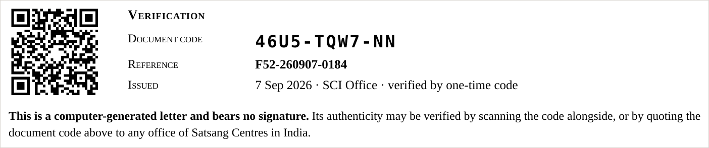
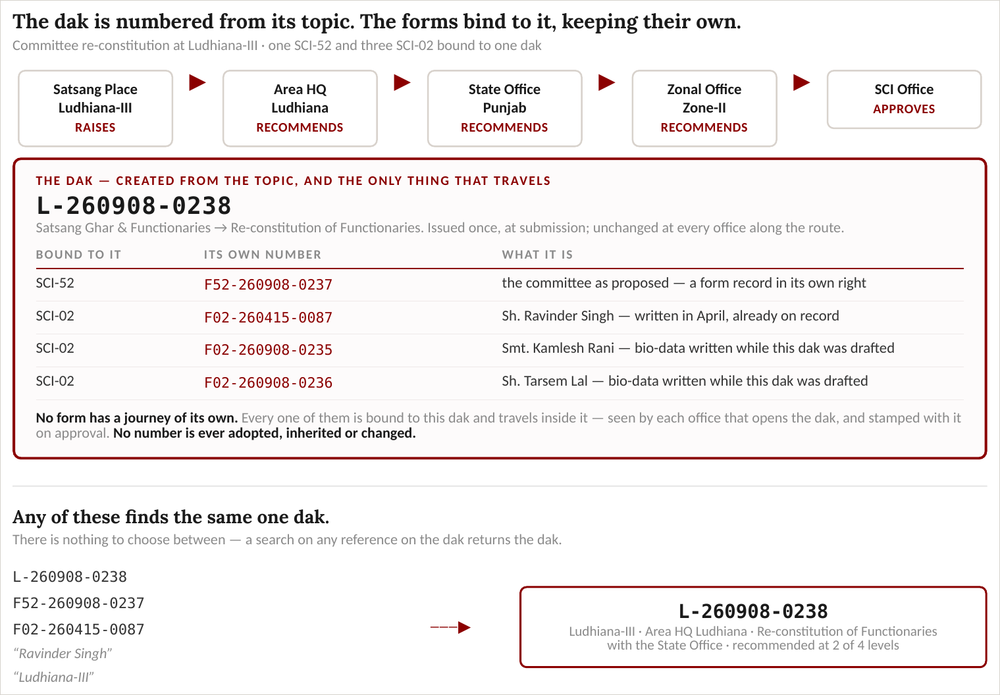

# DHS — Dak Handling System
## Scope

**Status:** For review · **Owner:** Zonal IT Team · **Date:** 7 September 2026

**Basis.** The discussion of 18 August 2026 with Zone-I, Zone-II and Zone-III and the SCI 2IC; the inputs received since; the Document Type and Subject listing under preparation with Sh. Prem Bansal Ji; and the working prototype, **DHS R1**, which demonstrates on screen a good part of what is described here.

**Review.** By **Zone-II and Zone-III**, Sh. Prem Bansal Ji; by **Zone-I**, Sh. Sumit Ji and Sh. Sandeep Ji; then **final review** by Col. Ajay Singh Ji, 2IC, SCI Office. What is settled at the end of that becomes the baseline on which the working system is built.

---

## How to read it

The document is in three parts.

**Part One** is the narrative. It can be read straight through, and it is the part to comment on.

**Part Two** is the requirements register — **312 numbered requirements**, for line-by-line confirmation and eventual sign-off. Each carries a priority, where it came from, whether it is settled or still our own reading, and whether the prototype demonstrates it.

**Part Three** holds ten annexures, among them the routing matrix, the numbering scheme, the record of open decisions and the full specification of SCI-52.

**Reviewers are requested to mark against the section numbers**, so that each input can be traced to its source.

---

## What R1 already shows

A working prototype accompanies this document. It is not a mock-up: it routes, decides, numbers, prints and refuses, and it is checked by an automated suite of **761 assertions** which must pass before any version is issued.

Because of that, every requirement in Part Two carries a mark saying whether a reviewer can **see it working**:

| Mark | Meaning |
|---|---|
| **&#10003;** | shown in R1 — open the prototype and it is there |
| &#9675; | partly shown — the mechanism exists, the full behaviour does not |
| &mdash; | not yet shown |

Across the 308 requirements that carry a mark, **134 are demonstrated, 54 partly, and 120 not yet**. The mark is deliberately conservative: where there was any doubt it was set to *not yet shown*, so the count understates rather than flatters.

**One caution.** The mark is not the requirement's status. A requirement may be settled, confirmed and wholly agreed and still carry a dash, because nothing has been built to show it. Hosting is the clearest example — it is decided, and there is nothing to demonstrate.

---

# PART ONE — THE SYSTEM

## 1 · What is being built

A single system for all correspondence within the SCI hierarchy, replacing the movement of paper with a digital loop.

- Operates at **all five levels** — SCI Office, Zonal Office, State Secretary Office, Area HQ, Satsang Place
- Covers **three kinds of item** — SCI Forms, general letters between offices, and circulars
- **All-India** — Zone-I, II and III together: 5,408 satsang places, 191 areas, 27 states
- Dak is entered **by the satsang place, or by the Area HQ on its behalf** where a place is not equipped for it. Correspondence is raised by **Major Centres and Centres**; **Sub Centres and Points raise none** and have read-only access to the letters concerning them
- A place can **see and track an item throughout its life**, even where the Area HQ raised it on their behalf

## 2 · The topic is the prime driver

Most correspondence is not a free letter that a sewadar addresses by hand. It is a **known topic** — a Document Type and a Subject — and each topic has a settled way of travelling. That is what the system is built upon.

**The sewadar picks what the matter is about, and the system settles the rest** — where it goes, who decides it, which form must accompany it, and how it closes. They are never asked to choose a level, an addressee, or whether something is confidential.

A Secretary at a place picks *Accounts → Opening of Bank Account* and is done. Topics not in the list fall to **Miscellaneous**, which uses the general one-level correspondence path of §4.

**The shell that follows from it.** Because the topic carries the routing, the home screen reduces to three things — **start a dak**, pick a topic and fill a little; **my work**, what needs this office; and **track**, where my submissions have reached. Everything else — masters, registers, reports, configuration — sits under a secondary menu, out of the everyday way.

**What is in the listing so far.** A good number of Document Types and Subjects have already been identified, from the working of Zone-II and Zone-III. **Zone-I has yet to contribute to it**, and the listing is expected to grow on that account and on others. This is not a limitation: a Document Type or a Subject can be **added whenever the need arises**, and its workflow defined at the same time — where it originates, how far it travels, who decides it, what form goes with it. Nothing in the design depends on the listing being complete before the system is used.

## 3 · The Topic Master — the workflow held as data

The listing becomes the **master that drives the system**. One row per Document Type and Subject, holding:

| Field | Meaning | Example |
|---|---|---|
| **Document Type · Subject** | the topic | Accounts · Opening of Bank Account |
| **Origin level** | who may raise it | Centre · Major Centre · Area HQ and above |
| **Mode** | Information or Approval — decides closure | Approval |
| **Path and terminal authority** | how far it travels, and who finally decides | up the chain to the SCI Office |
| **External hand-off** | where the SCI Office passes it on, outside DHS | Accounts Dept, Beas (by email) |
| **Instrument** | plain correspondence · a template · one or more **SCI forms** | SCI-15 |
| **Thresholds** | where a value or limit decides the level | donation value bands; imprest limit |
| **Prior-reference** | must quote an earlier approval to proceed | a cancellation quotes the original |
| **Flags** | confidential-allowed · peer-allowed · **retired** | — |

**The common skeleton.** Reading the worked rows, nearly every topic is one skeleton with these fields set differently:

```
 Origin ──▶ recommend up the chain ──▶ Terminal authority (Zone or SCI)
                                              │
                    ┌─────────────────────────┼─────────────────────────┐
              Information                  Approval                External hand-off
              closes there          decision returns to raiser     (email / portal)
```

**Closure follows the Mode.** An *Information* item travels up and closes at the terminal office. An *Approval* item travels up to the deciding authority, and **the decision travels back down** to the office that sought it.

**Thresholds and form links change occasionally** — about once a year. They are held **in the master, not in code**, so an administrator changes a threshold or swaps a form without a developer. **A topic that falls out of use is flagged as retired rather than deleted**, so that dak raised under it remains readable.

**Versioned and effective-dated.** Every change takes effect from a date, and an item **already in flight keeps the workflow it started under**, so a change never disturbs dak mid-course. The version in force is recorded on each item.

## 4 · General correspondence

**How a letter may be addressed**

- **One level up or one level down** — no office may be addressed two levels away, as that would set aside the authority in between. Where a matter must travel further, each office records its recommendation at its own level and passes the same letter onward
- Or **to a peer at its own level** — a place to another place of its area, an area to another of its state, a state to another of its zone, a zone to another zone. **Not across those boundaries.** Peer correspondence is for general letters only, is never confidential, and is **always visible to the level above**
- A letter from a peer **begins and ends between peers**. Where a decision from above is needed, the office writes to its own superior as a fresh letter
- The system offers **only those offices to which a letter may properly go**, so nothing can be misdirected
- **No correspondence leaves an office without the approval of the authority of that office**, as no physical letter is despatched without the signature of the head of the office

**How a letter is handled**

- Letters are **written inside the system** in a rich-text editor — no scanning, no email. Paper received from outside is recorded by upload with a mandatory scan
- Classified by **Letter Type (Open / Confidential)**, **Document Type** and **Subject**, driving marking, visibility, search and reporting
- **Marked automatically** to the particular person deputed for that subject; subject-wise marking supersedes area-wise
- Queries, clarifications and replies are **exchanged inside the system**, held against the letter itself
- Every movement is recorded in a trail that cannot be altered
- The **age of an item is visible to every level above it**, and service standards are to be settled for how long an item may lie at each office

**Replying and forwarding.** A reply or a forward is bounded by the dak's own route: recipients are offered only where that item may properly go — back down the line it came, onward to the next office, or to a peer as a copy. A **copy** is read-only, is tagged as such, and never enters anyone's pending list.

**How an item is found by an office.** Two things are recorded against every item, and everything else derives from them: **its movement** — from which office to which, and where it stands now — and **the office it concerns**. Inward and outward are not marked on a letter; the same letter is outward for one office and inward for another, so direction follows from the movement. Each office therefore has its inward and outward register as a view, printable for any period, **without any numbering of its own**.

## 5 · Circulars

- Issued by the **SCI Office, a Zonal Office, a State Office or an Area HQ** — not by satsang places — and only on the approval of the authority of that office
- The issuer chooses **how far down** it reaches, and **which branches** — for instance the satsang places of Zone-I, all Area HQs of Zone-II, or selected states of Zone-III and every office beneath them
- Offices lying **between the issuer and the recipients also see it**, so no office is unaware of what has gone to those beneath it
- **Recipients acknowledge receipt**, and the issuing office sees who has and who has not, and may remind those outstanding
- A circular **may require a return** by a date, tracked office by office, appearing in the recipient's pending list and calendar
- A circular may be **superseded or withdrawn**, the earlier one remaining on record

## 6 · SCI Forms

- Filled digitally, validated, routed through the approval chain, and **produced in the exact official SCI format**, so records practice at Beas is unchanged
- **The first release covers SCI-52** (Constitution / Re-constitution of Committee) **with SCI-02** (Bio Data of Functionaries) as its enclosure, and **SCI-15** (Offer of Items / Material in Donation), whose approval limits are settled and working
- **Each form is studied individually** and given provisions specific to its own requirements — fields, tables, validations, enclosures, approval chain and the documents it produces. A specification is prepared before any building. **Annexure J is the first of these**, for SCI-52
- Where a form requires another as an enclosure, the enclosure is carried digitally, and **both copies are shown** — the form as the system produced it, and the signed copy that was uploaded
- **The remaining SCI forms are to be brought in shortly**, each in the same way — studied, specified, then built

**Eligibility to hold sewa as a functionary** — one year completed since initiation; age not below 30 nor above 70; and a Satsang Karta, Area Secretary, State Secretary or Zonal Secretary to be a graduate, save where the SCI Office in its discretion approves an exception, which is recorded.

**Which office approves which designation** — committee functionaries and Satsang Kartas are approved by the **SCI Office**; Satsang Readers and Pathis by the **State Secretary**; Baal Satsang Kartas, Baal Satsang Pathis and other functionaries of Baal Satsang by the **Zonal Secretary**.

**The approval limits on SCI-15, settled.** Nothing is approved at Satsang Place or Area level. Thereafter the approving office follows the nature of the offer and its value:

| Nature of donation | State Office | Zonal Office |
|---|---|---|
| **Capital** | up to ₹25,000 | up to ₹50,000 |
| **Revenue** | up to ₹10,000 | up to ₹25,000 |

Where an offer carries items of both natures, the **higher of the two offices governs**. The limits are held as settings, not in code, and are changed by an administrator without a developer. **What is approved above the Zonal ceiling is the one thing still open** — such an offer is routed to the SCI Office provisionally, and is marked as provisional on screen until it is settled.

**The period of an approval.** An approval runs for a stated period. **An extension is not sought on SCI-52** — a form that grants approval for a period would, if used again, amount to extending it of itself; an extension is sought through general correspondence. Where a period is granted both on an approved SCI-52 and on a separately approved extension, **the later of the two expiry dates governs**, and the record shows which instrument granted it. Approvals nearing expiry are flagged in good time.

### 6a · What a form reads, and what an approval takes effect upon

A form holds no data of its own. It reads from the records of Satsang Places and of functionaries, and an approval takes effect upon them.

**From the Satsang Place record**, two things are settled before a form is even opened: **which designations that Satsang Place may have**, its type deciding them; and **the route a form from that Satsang Place will travel**, its reporting line deciding that. A Major Centre reporting directly to its Zonal Office has a shorter route than a Centre, and the system takes this from the record rather than assuming a fixed path.

**From the functionary record** come the particulars of the person — father's name, date of birth, date of initiation, qualification and profession — so that SCI-02 is not keyed afresh each time. A person is recognised as **the same person across Satsang Places**, so that a relief at one Satsang Place and an appointment at another read as one person's history, though the two events arrive on two forms from two different Satsang Places.

**Two masters hold this data, and DHS maintains them.**

- The **Satsang Place Master** — every place with its Beas File No., date of inception, type, the place it is attached to, and the Area HQ, State Office and Zonal Office it falls under. This is what settles the designations a form may offer and the route it will travel.
- The **Functionary Master** — every functionary with father's or husband's name, date of birth, date of initiation, qualification, profession, years of sewa, the sewa presently held and the period it runs for. One record per person, held **across Satsang Places**, so that a person's history reads as one.

**An approval is what changes them.** On approval, a form **closes what has ended and opens what has been granted**, with the period against each. **No office edits either master directly** — every change is traceable to the form that carried it. Both are seeded once from SCM and kept current thereafter from approvals alone (§15).

**One matter is open.** Recognising the same person across Satsang Places needs more than a name and a father's name. The particulars sought for this purpose, and the manner in which they may be made available, are placed before DCC.

## 7 · Approvals, stamps, and the papers a decision produces

### 7a · How an approval is given

- Approval and recommendation rights rest **only with designated users**
- The authority **verifies at the moment of approving**, not merely at signing in — a one-time code to their **registered email address**. Where the network is poor, a **passkey** may be used instead. SMS is not used
- Items put up for an authority are gathered into an **Approval Tray**: select all, or pick a few, and **one verification approves the whole selection**, each item still carrying its own approval in its own trail. Available on a mobile telephone as well as at a desk
- Approval events are written to an audit log that can be evidenced later

### 7b · Every authority in the line leaves a stamp

Every office that handles an item leaves **one stamp** on it — the office that signed and submitted it, each office that recommended it onward, and the office that decided. A stamp carries the **office, the person, the designation, the date and the item's own reference**, and the stamps read in the order the item travelled.

**No stamp mints a number of its own.** Every one of them quotes the item's Dak ID, so that the rule of one item, one number holds through the papers as well as through the workflow.

### 7c · The two papers, and they do different work

The moment a decision is recorded, the system writes the papers that follow from it. Nothing is drafted by hand.

**The Approval Letter goes out.** It is the instrument handed to the committee, so it carries the substance of the decision rather than a reference to it — on an SCI-52: who is appointed and on whose bio-data, who continues and with what change of designation, who stands relieved and on what ground, and **the committee as it now reads**. On an SCI-15: the items sanctioned, each with its nature and amount, and the total sanctioned. It is issued on the deciding office's paper, addressed to the office that raised the matter, and it bears the **stamp of the final approving authority** — it being that authority's letter, not the line's.

**The duly approved form stays.** The official format is not altered. Where the printed form provides its own recommendation boxes — as SCI-52 does for the Area Secretary and the Zonal Secretary — those are filled in with the officer's name, the date and the reference. Travelling with it is an **endorsement page carrying the stamp of every authority in the line**.

- Both papers are **downloadable and printable at every level involved**; an office not on the route sees neither
- Both are kept **permanently**, in two registers — Approval Letters and Approved SCI Forms — searchable and unaffected by anything that happens to the item afterwards
- A **refusal produces the same papers** — a letter saying the proposal has not been approved, with the reason, and the form endorsed accordingly
- Still to be produced alongside these: a **relieving letter** for each member resigned or relieved, and the equivalent conveyance for other forms
- Documents are **template-driven**, a fixed template per letter, maintained by an administrator without recourse to development
- Generation and reprints are recorded in the trail; documents remain retrievable from the item

### 7d · How an unsigned letter proves itself

The Approval Letter is issued on a one-time code, not a pen, so it carries no signature. Three things make it stand as an authentic document, and the first two are already in place.

**Who decided** — the stamp of the approving authority: office, name, designation and date.

**That the decision is on record** — the dak reference, which any office in the chain can open.

**That an outsider can check it** — this is what a signature would ordinarily do, and what replaces it is a **Document Verification Code** printed on the letter, with a QR beside it. The code is **derived from the content of the decision**, not allocated from a counter: the same letter always yields the same code, and a letter altered in any particular would not. A committee member scans it and sees, without signing in, that a letter of this reference was issued on this date by this office on this subject — and nothing further.

The letter says so in terms, and this is how it prints at the foot of the letter:



The words on it read: *"This is a computer-generated letter and bears no signature. Its authenticity may be verified by scanning the code alongside, or by quoting the document code above to any office of Satsang Centres in India."*

That is the ordinary convention for computer-generated official documents, and the same one used on income-tax, GST and bank statements.

**Why the code cannot simply be made up.** It is not drawn from a counter and it is not sequential. It is computed from the reference, the decision, the date and the deciding office, under a key held on the server. So:

| | |
|---|---|
| the same letter, printed again | yields **the same code**, every time |
| the decision altered from *approved* to *not approved* | yields a **wholly different code** |
| one digit of the reference altered | yields a **wholly different code** |

A forged letter cannot carry a code that verifies, and an authentic one cannot be altered without its code ceasing to match.

- The code is a **check, not a number**. The dak reference still governs; one item still carries one number
- A **scanned signature is deliberately not used**. A stored signature image can be placed on anything by whoever reaches it, and would weaken the letter rather than strengthen it
- The settled answer, when it can be arranged, is a **digital signature on the PDF** — cryptographic, tamper-evident, and verifiable in any PDF reader. It needs a certificate and key custody, which is for DCC to arrange; nothing here depends on waiting for it

## 8 · Users, access and confidentiality

**Confidential letters** are marked by a Signing Authority, and seen only by the authority they are addressed to, above or below — not by the office staff of either level.

Where an authority wishes a member of staff to handle such letters, **one member of that office may be given Special Status** — one only, conferred from the authority's own login. They see everything the authority sees, confidential letters included, and act in effect as second-in-command. **A Special Status member does not set roles.** Where an office wishes it, the authority may confer that power upon them, and it then extends to others at that office only — never to their own role, nor to the authority's. **Approval nevertheless remains with the authority**; the verification code goes to them, never to the Special Status member.

Every level therefore has **three kinds of login** — **Signing Authority**, **Office Staff** and **Special Status** — administered from a configuration screen. To these R1 adds **department members** at the Zonal Office (Engineering, Legal, Accounting and such others as an office needs), who see only their own category of dak, and a **DHS Admin** who maintains topics, workflows and access.

The **Signing Authority holds every power that exists at that office**; office staff exist to assist, the work being too great in volume for one person. **Office staff** attend to the dak allotted to them, draft replies, and verify that forms are duly completed — **returning what is incomplete to the sender**, and **putting up what is in order** to the Authority with their remarks. They do not recommend, approve or mark a letter confidential.

A return for correction is a check of completeness, not a decision, so it needs no signature. It is **not a new letter** but a movement on the same item, and **Returned for correction** is a distinct status from **Not approved** — the first leaves the item with the sender to act upon, the second closes it.

## 9 · User Access Management — two options

| | Option 1 — **DCC's UAM** *(preferred)* | Option 2 — **DHS's own UAM** |
|---|---|---|
| How | DHS uses DCC's existing user directory and authentication | DHS maintains its own user directory and authentication |
| Condition | Joint feasibility work with DCC — integration, role mapping, provisioning at satsang-place scale, and verification at the moment of approving | Hosted on the **Beas server** alongside the application |
| In both cases | DHS keeps its own authorisation layer — what a user may do on an item at a given level — as this is specific to DHS | |

## 10 · Marking and duty allocation

- Dak is auto-marked by subject and sub-category **to the particular person deputed for it**, not merely to an office
- Allocations are **set through a configuration screen**, provided to begin with at SCI Office, Zonal Office and State Office
- A **Duty Allocation Chart** shows at a glance who is deputed for what, readable **subject-wise** and **person-wise**, with the pending load beside each allocation
- An allocation may carry a deputy; where no one is deputed, the item falls to the office inbox and the gap is flagged
- Allocation changes are effective-dated and audited, with bulk reassignment when a sewadar is relieved or transferred

## 11 · Uploads and attachments

- Upload of the **soft copy of physical dak**, and of **any further attachment** — enclosures, photographs, estimates, drawings, bio-data
- **Formats**: PDF preferred for dak and enclosures; JPG and PNG for photographs; DOCX and XLSX where a working file is needed. Archives and executables not permitted
- **Size — not more than 5 MB per file**, subject to discussion and approval, and **every upload is compressed on receipt**, so what is stored is a fraction of what was sent. A mobile photograph of 4–5 MB typically stores at 300–600 KB, and a scanned PDF at under 1 MB, without losing legibility. Compression is done on the Beas server itself, with nothing sent to any outside service (Annexure I)
- **Count**: set individually for each SCI form in its definition; for **general correspondence, up to 3 uploads**
- **Mandatory uploads** are configurable by document type and by form — the item cannot be submitted until they are supplied
- **A wrong attachment can be replaced** — freely before submission; afterwards by the uploader or an authorised user, with a reason recorded and the earlier file retained as superseded. Not after a decision has been taken
- File types are verified by content and scanned for malware; attachments follow the item, and a later level cannot remove what an earlier one placed

## 12 · Work allocation, views and tracking

- Every user has a pending list of the dak allocated to them
- Allocation combines **rule-based auto-marking** (the default), an **office inbox with claim**, **supervisor assignment**, **delegation to a deputy**, and **escalation on ageing**
- Work is shown in **switchable views — Board, List, Timeline and Calendar** — the default set by role: clerical users to a working list, authorities to the Approval Tray, Zonal and SCI Offices to the board
- The **board** carries ageing bands — within 7 days, 8–30 days, beyond 30 days — with swimlanes by zone for the SCI Office
- A **Calendar for users at every level**, showing what falls due when, **clickable throughout**: a day lists its items, an item opens the item itself. **Reminders** may be set on any dak, with an option to keep it out of the pending list until the reminder falls due
- Movement between stages follows from actions and rights; the board reflects the workflow rather than driving it

**Tracking.** The originating office sees **where its item has reached**, stage by stage with dates, without telephoning the office above. Anyone party to the item sees the **full trail** — messages, recommendations, decisions. Where something is awaited **from the originator**, it is shown to them prominently as an action required. Lookup is by Dak ID, or from one's own list of submissions.

## 13 · Reporting — by level

**One report is common to every level: *Awaiting the next authority*** — what this office has recommended onward and the office above has not yet acted upon, with the date it was sent, the office it is now with, and how long it has lain there. Every office needs to see where its own work has stopped, without telephoning to ask.

| Level | Principal reports |
|---|---|
| **Every level** | **Awaiting the next authority** — sent onward by this office, not yet acted upon above, with ageing |
| **Satsang Place** | My pending dak · status of my submissions · decisions received · items awaiting clarification from me |
| **Area HQ** | Area pendency by place, subject and officer · place-wise volumes and participation · awaiting Area Secretary recommendation · ageing and overdue · reminders · area donations register · committee and functionary changes |
| **State Office** | Area-wise pendency and comparison · items within State Secretary authority · turnaround by area · donations within the cap · overdue and escalated · state volumes |
| **Zonal Office** | State and area pendency · pending by marked-to officer · **sent to SCI Beas and runsheet** · decisions received · end-to-end turnaround and time held at each level · zone volumes · donations register · ageing dashboard · adoption |
| **SCI Office** | All-India pendency **zone-wise** with drill-down · pending with SCI by zone and form · forms awaiting and decided · turnaround by zone and form · volume trends · **committee and functionary changes approved** · all-India donations · zone comparison scorecard · ageing across zones |
| **Administration** | Approval audit log · user activity and adoption · auto-marking effectiveness · **migration reconciliation** · storage usage |

All reports are filterable by period, category and office, and exportable to Excel and PDF. Higher levels inherit the reports below, scoped to their jurisdiction. The full catalogue is at Part Two, Section G.

## 14 · Numbering

**A dak is created from a topic, and takes its number from that.** Never from a form. A form is part of a dak; a dak is not part of a form.

```
L-260908-0231        a dak — correspondence, whatever it may carry
C-260908-0233        a dak — a circular
```

**There are two kinds of dak, so there are two markers.** `L` for correspondence and `C` for a circular, and the topic settles which — nobody chooses. Then the date, then a running number.

**A form carries a number of its own, from the same series.**

```
F52-260908-0237      an SCI-52 record
F02-260415-0087      an SCI-02 record
F15-260901-0102      an SCI-15 record
```

So the marker says at once what is in your hand: **`L` or `C` is a dak; `F` is a form.** There is no case where the two can be confused, and none where a number has to be adopted, inherited or changed.

**A form binds to a dak, and neither number moves.** The dak keeps `L-260908-0231`; the form keeps `F52-260908-0237`; the dak shows the form among its enclosures, and the form shows which dak it is bound to. A form written in the form space before any dak exists is already numbered, and binding it later changes nothing.

**One national counter per date serves both**, so no two things anywhere carry the same number. The running number is **unique across India for that date** — which is what lets any office quote a number and every other office find the same thing. The date is written **YYMMDD**, reading almost as before but sorting correctly in every list.

### 14a · What travels, and what is merely carried

Only the dak travels. Forms are carried inside it, the way papers sit inside a file cover: every office that opens the dak sees all of them, and **no form has a route, a pending list or an inbox of its own**.



So a topic requiring two or three forms changes nothing about movement. **One dak, one number, one journey, one place in one office's pending list at any moment.** The question of which number it travels under does not arise, because only one thing is travelling.

**And it is found by any of them.** A search on the dak's number, on any form bound to it, on a person named on those forms, or on the Satsang Place, returns the same single dak. They are ways in, not alternatives to choose between.

### 14b · Worked through, case by case

**Case 1 — a topic with no form.** The common case.

> *Accounts · Opening of Bank Account.* The Secretary picks the topic, writes the letter, submits.
> **Dak No. `L-260908-0231`.** Nothing else is numbered.

**Case 2 — a circular.**

> *The Zonal Office issues a circular to all Area HQs of its zone.*
> **Dak No. `C-260908-0233`.**

**Case 3 — a topic requiring one form.**

> *SCI-15 · Offer of items in donation.* The Secretary picks the topic; the topic says an SCI-15
> must accompany it. He fills the form within the dak and submits.
>
> **Dak No. `L-260908-0234`** &nbsp;·&nbsp; bound to it: **`F15-260908-0235`**
>
> Two numbers, because there are two things: a movement, and a form. Neither borrows from the other.

**Case 4 — the form was written earlier.** Nothing special happens.

> The SCI-15 was filled in the form space on 1 September and numbered **`F15-260901-0102`** then.
> On 8 September it is bound to a dak raised on the same topic.
>
> **Dak No. `L-260908-0234`** &nbsp;·&nbsp; bound to it: **`F15-260901-0102`**
>
> The form keeps the number it has had since it was written. The dak takes today's. There is no
> adoption and no oddity of dates.

**Case 5 — a topic requiring one form with several enclosures.** The SCI-52 case, followed through as it happens.

```
 15 Apr 2026   A bio-data is written for Sh. Ravinder Singh in the form space.
                                                     → F02-260415-0087

  8 Sep 2026   The Secretary of Ludhiana-III picks the topic
               Satsang Ghar & Functionaries → Re-constitution of Functionaries,
               and begins the dak. He fills the SCI-52 and adds three members:

                 Sh. Ravinder Singh   selects the bio-data already on record
                                                     → F02-260415-0087   (no new number)
                 Smt. Kamlesh Rani    new bio-data, saved
                                                     → F02-260908-0235
                 Sh. Tarsem Lal       new bio-data, saved
                                                     → F02-260908-0236

               The SCI-52 is numbered when it is completed
                                                     → F52-260908-0237
               The dak is numbered when it is submitted
                                                     → L-260908-0238

               The dak now reads:

                 Dak No.     L-260908-0238
                 Bound to    SCI-52   F52-260908-0237
                             SCI-02   F02-260415-0087   Sh. Ravinder Singh
                             SCI-02   F02-260908-0235   Smt. Kamlesh Rani
                             SCI-02   F02-260908-0236   Sh. Tarsem Lal
```

Five numbers in all, for five distinct things: one movement and four forms. The counter runs 0235, 0236, 0237, 0238 in the order they were created, and the marker tells a reader which is which.

**Case 6 — a topic requiring two forms, both to be decided.** No special case is needed. The dak takes its number; each form takes its own; both bind to the dak.

> **Dak No. `L-260908-0240`** &nbsp;·&nbsp; bound to it: `F52-260908-0241` · `F56-260908-0242`

**Case 7 — what does not change a number.** Returning a dak for correction, forwarding it onward, a decision travelling back down, filing it at the end: the Dak No. is issued once, at submission, and never changes. Nor does a form's number, once written. A **migrated** item keeps its legacy reference as a searchable field, shown beside its Dak No. — never in place of it.

**A number is never shown alone.** It is a settled convention that the particulars accompany it wherever it appears:

> **L-260908-0238** · SP: Ludhiana-III · AHQ: Ludhiana · Committee re-constitution

**There is no second numbering.** No office keeps its own inward and outward numbers. What it keeps instead is its inward and outward register as a view, produced from the record and printable for its own use. The scheme in full is at Annexure E.

## 15 · Hosting, SCM and migration

**Hosting — on the Beas server, by DCC**, as acknowledged in the last meeting. Environments, deployment, backup and disaster recovery to be agreed with them; security controls to follow their direction.

**Data from SCM, and back.** The governing principle is that **the SCI Office's present way of working is not disturbed.**

*First — one ingestion from SCM.* Before the system is used, two sets of data are taken across once: **satsang places**, with everything held against them — Beas File No., date of inception, the Area HQ, State Office and Zonal Office they fall under, the type of place and the place it is attached to; and **functionaries**, with their sewa particulars — designation, place, dates of birth and initiation, qualification, profession, years of sewa, present status, and the period for which the approval runs. Zone, state and area divisions come across with them.

*Thereafter — every change comes from an approval.* Nothing alters that data except an approval properly given on a form: an appointment, a change of designation, an extension, a retirement, a relief, a demise. There is no free editing. The system keeps its records current from those approvals, so the next form for that place opens already correct.

*And back to SCM — as at present.* The SCI Office team continues to enter approvals into SCM exactly as it does today. **Their process does not change.** What changes is only what lies before them: instead of reading a letter and picking out the changes, they work from a **change list** stating precisely what is to be entered — place, functionary, what has changed, from what to what, on whose approval and on what date. The list records whether it has been entered, so nothing is missed or entered twice.

**SCM remains the official record throughout.** The system holds a working copy only so that sewadars are not asked to enter again what Beas already holds.

**Migration from the existing systems.**

- Provision to migrate **all data from the two systems presently in use** — DHS in Zone-II and III, DMS in Zone-I
- Both databases to be **studied and mapped to the new model**, establishing what is imported and how
- Where the two differ in vocabulary — statuses, document types, subjects — a reconciliation map to be agreed with both zones before import
- Migrated items keep their **legacy reference number**, searchable and displayed beside the new Dak ID
- Migration staged and reversible: trial import → reconciliation report → sign-off → production import
- Items in flight at cut-over migrate with their stage intact
- **Access to the legacy databases is needed to begin the study**

## 16 · Naming

Naming of the new system is to be done by the **SCI Office**. "DHS" is used as a working name until then.

## 17 · What the R1 prototype demonstrates

R1 is a single self-contained file that runs in a browser, holds no data and sends nothing anywhere. It exists so that this document can be read against something working rather than imagined.

**Shown end to end**

- Topic-driven routing — the Document Type and Subject settle the path, the mode, the terminal authority, the mandatory forms and the value limits, and the limits themselves are editable as settings
- One Dak ID per item, issued at submission and never changed
- Office-instance scoping — each office sees its own dak, not everything at its level
- The kinds of login, including departments at the Zonal Office and a DHS Admin
- Reply and forward with recipients and copies, bounded by the dak's own route
- **SCI-15, SCI-52 and SCI-02 reproduced in the official format**, with a side-by-side view of the entry form and the sheet as it will print
- Approval by one-time code, at a desk and on a mobile telephone, one verification serving a whole selection
- **The papers a decision produces** — the Approval Letter carrying the particulars in full over the approving authority's stamp; the duly approved form with its recommendation boxes filled and an endorsement page bearing every authority's stamp; and Approved Records keeping both
- Inward and outward registers, the report catalogue, the workflow board, the calendar with reminders
- Light and dark, and a mobile layout throughout

**Deliberately not in R1**

- Any connection to SCM or the Beas systems
- Real authentication — the login switcher is a demonstration device
- Migration of the existing DHS and DMS records
- The central counter that issues the Dak ID — the scheme is settled; the prototype counts in the browser
- **Workflow versioning is asserted but not yet enforced.** A topic carries a version, an effective date and a history, and publishing a change says that dak in flight keep the version they started under — but the dak record does not yet hold which version that was. The version must be stamped on the item at submission and the routing read from it, so that the rule is demonstrable and not merely stated
- Circulars — provided for in this scope (§5) but not yet built into the prototype

## 18 · What is open, and with whom

This is the list to rule on. Everything else in this document is either settled or is our own reading, marked as such in Part Two.

| # | Matter | With |
|---|---|---|
| 1 | **Subject listing and approval levels** — the list of subjects on which correspondence is raised, and the level at which each is decided. A workbook has been issued for this | Sh. Prem Bansal Ji |
| 2 | **Value thresholds** where the approving level turns on an amount — needed before SCI-15 can be specified | Sh. Prem Bansal Ji |
| 3 | **What is approved above the Zonal limit on SCI-15.** The limits given stop at the Zonal Office — capital ₹50,000, revenue ₹25,000. Anything larger is presently routed to the SCI Office **provisionally**, and marked as such on screen | Sh. Prem Bansal Ji · SCI |
| 4 | **Service standards** — how long an item may lie at each level | Zones |
| 5 | **UAM route** — DCC's UAM, or DHS's own on the Beas server | DCC · Zonal IT |
| 6 | Placement of the **State Secretary's recommendation** on the printed forms, pending the revised forms | SCI Office |
| 7 | **Whether the information sought from SCM may be made available**, and in what manner | DCC |
| 8 | Access to the **legacy databases** for the migration study | Zones |
| 9 | Confirmation of **upload limits** — formats, size and counts | Zones · DCC |
| 10 | **Further printed outputs** arising from decisions, beyond the SCI-52 approval letter | Zones · SCI |
| 11 | A **common status vocabulary**, so that the words suit every office | Zones |
| 12 | Which office issues the **relieving letter** — the SCI Office, or the Zonal Office on its behalf | SCI Office |
| 13 | Whether any office must quote a reference of its own on correspondence **leaving the sangat** — to a government office, bank or contractor | Zones |
| 14 | **How a functionary is recognised as the same person across places** — the particulars needed for this, and the manner in which they may be made available | DCC |
| 15 | **SCI internal dak-processing workflows** | Anita Ji |
| 16 | Which topics need **confidential or peer** handling, to be flagged in the listing | Bansal Ji · Zones |
| 17 | For hand-off topics, whether DHS also records an **acknowledgement from the Beas department**, or closes at the SCI Office | SCI Office |
| 18 | Whether a person **may hold sewa at more than one place at the same time**, and if so in which combinations | SCI Office |
| 19 | **Whether an office should see an item before it reaches it.** It has been put that an item raised at a Satsang Place for decision at the SCI Office ought not to appear at the State Office until the Area HQ has recommended it, nor at the Zonal Office until the State Office has, and so on. It bears on what each office's lists contain, and on whether an upper office can see delay at a level below. **To be settled after discussion with the Zonal Secretaries and the other stakeholders** | Zones · SCI |

The formal record of these, with what each bears upon, is at **Annexure C**.

## 19 · How this document will move

| Stage | With |
|---|---|
| Review — Zone-II and Zone-III | Sh. Prem Bansal Ji |
| Review — Zone-I | Sh. Sumit Ji and Sh. Sandeep Ji |
| **Final review** | **Col. Ajay Singh Ji — 2IC, SCI Office** |

What stands settled after the final review becomes the **baseline**, and the working system is built to it. Anything still open at that point is recorded as open rather than assumed, so that nothing is built on a guess.

---

# PART TWO — THE REQUIREMENTS REGISTER

Each requirement carries a **permanent identifier**. Please quote it when commenting, so that every
input can be traced to the line it concerns.

## How to read this register

| Field | Values |
|---|---|
| **Priority** | **P0** — required for the prototype showing · **P1** — required for the working POC · **P2** — later phase |
| **Source** | **M18** — the 18 August discussion · **ZO** — Zonal Office, subsequent input · **EST** — carried from established practice · **ZIT** — Zonal IT proposal, needs confirmation · **OPEN** — undecided |
| **Status** | **Confirmed** · **Proposed** (awaiting reviewer input) · **Open** (decision pending) |
| **R1** | **&#10003;** shown in the prototype · &#9675; partly shown · &mdash; not yet shown |

Requirements marked **ZIT / Proposed** are our reading of what the system needs; reviewers should
confirm, amend or strike them. **The R1 mark is not a status** — a requirement may be settled and
agreed and still carry a dash, because nothing has been built to show it.

> **General correspondence — settled.** Sections A to B6 are complete and agreed: who may raise, how
> letters are addressed, confidentiality and the three kinds of login, the approval tray, marking and
> duty allocation, uploads, scoping, circulars and peer correspondence. What remains open across the
> document is listed at Annexure C.

---

## A · Hierarchy, Users and Access

| ID | Requirement | Pri | Source | Status | R1 |
|---|---|---|---|---|---|
| DHS-A-01 | DHS shall operate across all five levels of the SCI hierarchy — **SCI Office, Zonal Office (ZO), State Secretary Office (SSO), Area HQ (AHQ), and Satsang Place (SP)** — completing the full correspondence loop. | P0 | M18 | Confirmed | **&#10003;** |
| DHS-A-02 | Coverage is **all-India across Zone-I, II and III** — 5,408 satsang places, 191 areas, 27 states. (Zone-I 1,122 · Zone-II 1,475 · Zone-III 2,811.) | P1 | M18 | Confirmed | &#9675; |
| DHS-A-03 | Dak may be entered **by the satsang place itself, or by the Area HQ on its behalf**, since not every place is equipped to do so. | P1 | ZO | Confirmed | **&#10003;** |
| DHS-A-04 | Satsang Place types (Major Centre, Centre, Sub Centre, Point) shall be supported, with Major Centres corresponding directly with ZO per the MC restructuring. | P1 | ZIT | Proposed | **&#10003;** |
| DHS-A-04a | **Correspondence may be raised only by Major Centres and Centres** among the satsang places. **Sub Centres and Points raise none**; they are given **read-only access** to the letters concerning them, and their dak is entered by the Area HQ on their behalf. | P1 | ZO | Confirmed | **&#10003;** |
| DHS-A-04b | Where the Area HQ raises an item **on behalf of a place**, that place shall be able to **see and track it throughout its life**, although it did not raise it. | P0 | ZO | Confirmed | **&#10003;** |
| DHS-A-05 | Role-based access shall scope every user to their office and level; a user sees their own office's correspondence and that of offices below, except where explicitly marked to them. | P0 | ZIT | Proposed | **&#10003;** |
| DHS-A-06 | **Confidential letters are required** — see Section A3. | P0 | ZO | Confirmed | **&#10003;** |
| DHS-A-07 | Sewadar changes (transfer, relief, appointment) shall not orphan pending dak; reassignment to the successor, and **delegation to a deputy during absence**, shall be supported. | P1 | ZIT | Proposed | &mdash; |
| DHS-A-08 | Given direct SP entry, onboarding shall be simple enough for occasional users — minimal fields, guided entry, and help text at the point of use. | P1 | ZIT | Proposed | &#9675; |

## A2 · User Access Management (UAM)

| ID | Requirement | Pri | Source | Status | R1 |
|---|---|---|---|---|---|
| DHS-A2-01 | User identity and access shall be managed through **one of two options**, to be settled with DCC. | P1 | ZO | Confirmed | &mdash; |
| DHS-A2-02 | **Option 1 (preferred) — DCC's UAM system.** DHS consumes DCC's existing user directory and authentication. Requires joint feasibility work with DCC on integration method, role mapping, provisioning of the very large SP-level user base, and support for step-up authentication on approvals. | P1 | ZO | Confirmed — feasibility pending | &mdash; |
| DHS-A2-03 | **Option 2 — DHS's own UAM system.** DHS maintains its own user directory and authentication, hosted on the Beas server alongside the application. | P1 | ZO | Confirmed | &mdash; |
| DHS-A2-04 | Whichever option is adopted, DHS shall retain its **own authorisation layer** — what a user may do on a given item, at a given level — since office-and-level scoping is specific to DHS. | P1 | ZIT | Proposed | &mdash; |
| DHS-A2-06 | The feasibility assessment shall record: user volume DCC's UAM must carry, provisioning and de-provisioning workflow, password/OTP policy ownership, and fallback if DCC's UAM is unavailable. | P1 | ZIT | Proposed | &mdash; |

## A3 · Confidential Letters, and the Three Kinds of Login

**Why it is needed.** A Signing Authority may wish to write to the authority above or below without the office staff at either level seeing the letter.

| ID | Requirement | Pri | Source | Status | R1 |
|---|---|---|---|---|---|
| DHS-A3-01 | A letter may be marked **Confidential**, and the option shall be available in **every Signing Authority's login**. | P0 | ZO | Confirmed | **&#10003;** |
| DHS-A3-02 | **Signing Authority** means: Secretary (place) · Area Secretary · State Secretary · Zonal Secretary · 2IC SCI · SIC SCI. | P0 | ZO | Confirmed | **&#10003;** |
| DHS-A3-03 | A confidential letter shall be visible **only to the Signing Authority to whom it is addressed**, whether that authority is above or below in the hierarchy. Office staff at either level shall not see it. | P0 | ZO | Confirmed | **&#10003;** |
| DHS-A3-04 | Confidential letters shall be excluded from office-wide lists, searches, reports and duty-allocation views for all but those entitled to see them. | P0 | ZIT | Proposed | **&#10003;** |
| DHS-A3-05 | Where an authority is not comfortable working the system, or wishes a member of staff to handle such letters, one member may be given **Special Status**. | P0 | ZO | Confirmed | **&#10003;** |
| DHS-A3-06 | **Special Status** shall be conferred **from the Signing Authority's own login**, upon a member whose office-staff login already exists at that level. | P0 | ZO | Confirmed | &mdash; |
| DHS-A3-07 | **Only one** member of an office may hold Special Status at a time. | P0 | ZO | Confirmed | &mdash; |
| DHS-A3-08 | A Special Status member sees **everything the authority of that level sees**, confidential letters included, and acts in effect as second-in-command of that office. | P0 | ZO | Confirmed | **&#10003;** |
| DHS-A3-08a | **A Special Status member does not set roles.** Where an office wishes it, the authority may confer that power upon them, and it then extends to **others at that office only — never to their own role, nor to the authority's**. | P0 | ZO | Confirmed | &mdash; |
| DHS-A3-09 | **Approval nevertheless remains with the authority** — the one-time code is sent to the Signing Authority's registered email address, never to the Special Status member. | P0 | ZO | Confirmed | **&#10003;** |
| DHS-A3-10 | Every level therefore has **three kinds of login**: **Signing Authority** · **Office Staff** (AO, SSO, ZO and the like) · **Special Status**. | P0 | ZO | Confirmed | **&#10003;** |
| DHS-A3-11 | A **configuration screen at each Zonal Office** shall manage these permissions on behalf of the whole hierarchy beneath it. | P0 | ZO | Confirmed | **&#10003;** |
| DHS-A3-12 | The conferring, alteration and withdrawal of Special Status shall be recorded in an audit log. | P1 | ZIT | Proposed | &mdash; |

## A4 · The Approval Tray

*So that an authority who is not at ease with computers can approve many items with a single verification.*

| ID | Requirement | Pri | Source | Status | R1 |
|---|---|---|---|---|---|
| DHS-A4-01 | Items put up for an authority's approval or recommendation by their office staff shall be gathered into a single **Approval Tray** in that authority's login. | P0 | ZO | Confirmed | **&#10003;** |
| DHS-A4-02 | The authority may **select all, or pick a few**, and approve the selection together. | P0 | ZO | Confirmed | **&#10003;** |
| DHS-A4-03 | **One verification serves the whole selection** — a single one-time code to the registered email address approves everything selected, rather than one code per item. | P0 | ZO | Confirmed | **&#10003;** |
| DHS-A4-04 | Each item nevertheless carries its **own approval record** in its own trail, naming the authority, the time and the verification. | P0 | ZIT | Proposed | **&#10003;** |
| DHS-A4-05 | The tray shall show, for each item, enough to decide upon it — the gist, the recommendations already made, and a means of opening the full record. | P0 | ZIT | Proposed | **&#10003;** |
| DHS-A4-06 | An item may be **set aside** from the tray, with or without a query, without disturbing the rest. | P1 | ZIT | Proposed | &#9675; |
| DHS-A4-07 | **A mobile version of the Approval Tray shall be provided in Phase 1** for Signing Authorities. Mobile access for other roles may follow in Phase 2. | P0 | ZO | Confirmed | **&#10003;** |
| DHS-A4-08 | Naming — *Approval Tray* is proposed, after the tray on a desk in which papers awaiting signature are placed. | P0 | ZIT | Proposed | **&#10003;** |

## A5 · What Each Kind of Login May Do

| ID | Requirement | Pri | Source | Status | R1 |
|---|---|---|---|---|---|
| DHS-A5-01 | **The authority of an office holds every power that exists at that office.** Whatever any member of that office may do, the authority may do also — raise a letter, raise an SCI Form, raise on behalf of a place, issue a circular, recommend, mark and read confidential letters, set the roles of that office, and configure its marking. | P0 | ZO | Confirmed | **&#10003;** |
| DHS-A5-02 | Powers are nevertheless bounded by what the **office itself** may do: a satsang place issues no circulars, so neither does its Secretary. | P0 | ZIT | Proposed | **&#10003;** |
| DHS-A5-03 | Office staff exist **to assist the authority**, the work being too great in volume for one person. Everything they do, the authority may do unaided from their own login. | P0 | ZO | Confirmed | **&#10003;** |
| DHS-A5-04 | Office staff see the incoming dak **allotted to them by the configuration screen** — by geography, subject, or such other criteria as are set. | P0 | ZO | Confirmed | **&#10003;** |
| DHS-A5-05 | **On general correspondence** — staff attend to a letter, prepare a draft reply where one is needed, and on finishing it **put it up to the authority's Approval Tray**. | P0 | ZO | Confirmed | **&#10003;** |
| DHS-A5-06 | **On SCI Forms** — staff read the form through and **verify that it is duly completed** for the authority's recommendation or approval. | P0 | ZO | Confirmed | **&#10003;** |
| DHS-A5-07 | Where a form is incomplete or improper, staff **return it to the sender**, either seeking correction or recording the reason it cannot proceed. | P0 | ZO | Confirmed | **&#10003;** |
| DHS-A5-08 | Where it is in order, staff **put it up to the authority with their remarks**, and it reaches the authority's tray for the final recommendation or approval. | P0 | ZO | Confirmed | **&#10003;** |
| DHS-A5-09 | Staff **do not recommend, approve, or mark a letter confidential**, and nothing they prepare leaves the office until the authority has signed it. | P0 | ZIT | Proposed | **&#10003;** |
| DHS-A5-10 | Returning an incomplete item for correction is **a check of completeness, not a decision**, and staff may do it without the Signing Authority's signature. | P0 | ZO | Confirmed | **&#10003;** |
| DHS-A5-12 | A return is **not a new letter** — it is a movement on the same item, and nothing additional appears in any list. | P0 | ZIT | Proposed | **&#10003;** |
| DHS-A5-13 | **Returned for correction** and **Not approved** shall be separate statuses, distinctly worded and coloured. The first leaves the item alive with the sender to act upon; the second is a decision and closes it. | P0 | ZIT | Proposed | **&#10003;** |
| DHS-A5-14 | The trail shall name **who returned it and in what capacity** — *"Returned by Sh. Ranjit Kumar, Office Staff — for correction"* — so that a completeness check is never mistaken for the Signing Authority's word. | P0 | ZIT | Proposed | **&#10003;** |
| DHS-A5-15 | A returned item shall appear in the sender's own list under **action needed from me**, with the reason for its return shown against it. | P0 | ZIT | Proposed | **&#10003;** |
| DHS-A5-16 | The **Signing Authority shall see what their staff have returned**, so that nothing goes back without their knowledge. | P1 | ZIT | Proposed | &#9675; |
| DHS-A5-17 | Staff may return an item **only before it has been put up**. Once it stands in the Signing Authority's tray, only the Authority acts upon it. | P1 | ZIT | Proposed | &#9675; |
| DHS-A5-11 | An item at an office therefore carries an **internal stage** — with staff · put up to the authority · decided — visible within that office and not outside it. | P1 | ZIT | Proposed | **&#10003;** |

## B · General Correspondence (free-form letters)

| ID | Requirement | Pri | Source | Status | R1 |
|---|---|---|---|---|---|
| DHS-B-01 | A letter may originate at any level, but may be **addressed only one level up or one level down**. | P0 | ZO | Confirmed | **&#10003;** |
| DHS-B-01a | **No level may be bypassed.** Addressing an office two or more levels away would set aside the authority of the office in between, and is not permitted. | P0 | ZO | Confirmed | **&#10003;** |
| DHS-B-01b | Where a matter must travel further, the office receiving it **records its own recommendation, approval or reversion at its own level, and passes the same letter onward** — one level at a time. The Dak ID does not change; the addressee does. | P0 | ZO | Confirmed | **&#10003;** |
| DHS-B-01c | Both the **original addressee** and the **office currently holding the item** shall be held, so that the letter's course can be read from the record. | P0 | ZIT | Proposed | **&#10003;** |
| DHS-B-01d | "One level" follows the **reporting line, not a fixed ladder** — a **Major Centre reports directly to the Zonal Office**, so the Zonal Office is its next level up. | P0 | ZO | Confirmed | **&#10003;** |
| DHS-B-01e | Decisions travelling downward pass through each level in turn. The **age of an item is visible to every level above it**, so that delay at any office is apparent without anyone having to ask. | P1 | ZO | Confirmed | **&#10003;** |
| DHS-B-01f | Where a post lies vacant or its holder is absent, the item is **not rerouted around that office**. Delegation to a deputy carries the work; ageing raises an alert to the level above, but never bypasses.| P1 | ZIT | Proposed | &mdash; |
| DHS-B-01g | **Service standards (SLAs) shall be settled** for how long an item may lie at each level, and the system shall measure against them, drawing attention as they approach and pass. The standards themselves are to be set in due course. | P1 | ZO | Confirmed — values awaited | &#9675; |
| DHS-B-02 | The system shall provide a **rich-text editor** for composing letters within DHS (born-digital — no scanning, no email). | P0 | M18 | Confirmed | **&#10003;** |
| DHS-B-03 | **Attachments** shall be supported on letters and on messages (scans, photographs, estimates, drawings). | P0 | M18 | Confirmed | **&#10003;** |
| DHS-B-04 | Physical dak received from outside shall be recorded by **upload with mandatory scan**; scanning guidance (light-weight, good-quality mobile scans) shall be carried into user help. | P0 | EST | Confirmed | &mdash; |
| DHS-B-05 | Every item shall carry **one permanent Dak ID** for its whole life. There is **no separate office numbering** — see **Annexure E**. | P0 | ZO | Confirmed | **&#10003;** |
| DHS-B-06 | Items shall be classified by **Letter Type (Open / Confidential)**, **Document Type** and **Subject**, all three driving marking, visibility, search and reporting. | P0 | EST · ZO | Confirmed | **&#10003;** |
| DHS-B-07 | **Auto-marking** shall route an item on the basis of subject, area and — for donation letters — value thresholds; **subject-wise marking supersedes area-wise marking**. | P0 | EST | Confirmed | **&#10003;** |
| DHS-B-08 | Auto-marking rules shall be **configurable by authorised administrators**, not hard-coded. | P1 | ZIT | Proposed | **&#10003;** |
| DHS-B-09 | A complete, immutable **trail** shall record every movement, action, actor and timestamp. | P0 | EST | Confirmed | **&#10003;** |
| DHS-B-10 | **In-application messaging** shall be threaded against the item — queries, clarifications and replies exchanged inside DHS rather than by email. | P0 | ZIT | Proposed | **&#10003;** |
| DHS-B-11 | Lifecycle operations shall include: mark and re-mark, raise query, record clarification, send reminder, record recommendation, forward to next level, send to Beas, record decision, convey decision to source, **send to destination and re-receive from destination**, and **send for filing**. | P0 | EST | Confirmed | &#9675; |
| DHS-B-12 | A **common status vocabulary** shall be settled with the zones, so that users and reports remain intelligible to all offices after transition (Annexure F). | P1 | ZIT | Proposed | &mdash; |
| DHS-B-13 | An **Action Alert** flag shall mark items requiring attention, and shall be available as a search and list filter. | P1 | EST | Confirmed | &#9675; |
| DHS-B-14 | **Destination** shall be held as a field distinct from *Addressed To*, supporting onward routing to a third office. | P1 | EST | Confirmed | &mdash; |
| DHS-B-15 | Search shall cover: letter type, Dak ID, document type, subject, area, satsang place, sub-centre/point, sender, addressee, reference no., marked-to, destination, status, action alert, date ranges, remarks — and donation attributes (quantity, worth, purpose, remark). | P1 | ZIT | Proposed | &#9675; |
| DHS-B-16 | Draft letters shall be savable and visible only to the author until sent. | P1 | ZIT | Proposed | **&#10003;** |
| DHS-B-17 | A printable version bearing office letterhead and the Dak ID shall be produced where a hard copy is required. | P1 | ZIT | Proposed | **&#10003;** |

## B2 · Marking Configuration and Duty Allocation

| ID | Requirement | Pri | Source | Status | R1 |
|---|---|---|---|---|---|
| DHS-B2-01 | Dak shall be **auto-marked by subject and sub-category to the particular person configured to handle it** — not merely to an office. | P0 | ZO | Confirmed | &#9675; |
| DHS-B2-02 | A **configuration screen** shall allow these allocations to be set and changed by an authorised administrator. | P0 | ZO | Confirmed | &#9675; |
| DHS-B2-03 | Configuration shall be provided **at every office that has staff to allot work to** — SCI Office, Zonal Office, State Office and Area HQ — each setting the allocations for its own dak. | P0 | ZO | Confirmed | &mdash; |
| DHS-B2-04 | A **Duty Allocation Chart** shall present, in one simple view at admin level, which user is deputed for which subject — so that allocations can be made and the flow of work overseen at a glance. | P0 | ZO | Confirmed | &mdash; |
| DHS-B2-05 | The chart shall be readable **both ways**: subject-wise (who handles this subject) and person-wise (what this person handles, and how much is pending with them now). | P0 | ZIT | Proposed | &mdash; |
| DHS-B2-06 | An allocation **may** carry a deputy in addition to the primary handler, to take over on absence or on ageing escalation. **Not mandatory.** | P1 | ZO | Confirmed | &mdash; |
| DHS-B2-07 | Where no person is configured for a subject, the item shall fall to the **office inbox** rather than remain unassigned, and the gap shall be flagged to the administrator. | P0 | ZIT | Proposed | &mdash; |
| DHS-B2-08 | Allocation changes shall be **effective-dated and audited** — who changed what, and from when — with items already in hand unaffected unless expressly reassigned. | P1 | ZIT | Proposed | &mdash; |
| DHS-B2-09 | The precedence rule shall remain: **subject-wise marking supersedes area-wise marking**; value thresholds apply within a subject where configured. | P0 | EST | Confirmed | &mdash; |
| DHS-B2-10 | Bulk reassignment shall be supported when a sewadar is relieved or transferred. | P1 | ZIT | Proposed | &mdash; |
| DHS-B2-11 | The chart shall show, alongside each allocation, the **current pending count and oldest item**, so that overload or neglect is visible without opening a report. | P1 | ZIT | Proposed | &mdash; |

## B3 · Uploads and Attachments

| ID | Requirement | Pri | Source | Status | R1 |
|---|---|---|---|---|---|
| DHS-B3-01 | Provision shall be made to upload the **soft copy (scan) of physical dak** received on paper. | P0 | ZO | Confirmed | &mdash; |
| DHS-B3-02 | Provision shall be made to upload **any further attachments** — enclosures, photographs, estimates, drawings, bio-data. | P0 | ZO | Confirmed | &#9675; |
| DHS-B3-03 | **Permitted formats** — proposed: PDF (preferred for dak and enclosures); JPG/JPEG and PNG for photographs; DOCX and XLSX where a working file is required. Archives (ZIP/RAR) and executables not permitted. | P0 | ZIT | Proposed | &mdash; |
| DHS-B3-04 | **Maximum size — not more than 5 MB per file**, subject to discussion and approval. Every upload is compressed on receipt (DHS-B3-07), so stored size is materially smaller than the size sent. | P0 | ZO | Confirmed | &mdash; |
| DHS-B3-05 | **Number of files** — set **individually for each SCI form** in its definition. For **general correspondence, up to 3 uploads**. | P0 | ZO | Confirmed | &mdash; |
| DHS-B3-06 | **Mandatory uploads** shall be configurable — by document type and by form — and the item shall not be submissible until they are supplied. Scan is mandatory for uploaded physical dak. | P0 | ZO | Confirmed | &#9675; |
| DHS-B3-07 | **All uploads shall be compressed on receipt** using self-hosted, open-source processing suited to the Beas server (no cloud service dependency) — see **Annexure I — Upload Compression**. | P0 | ZO | Confirmed | &mdash; |
| DHS-B3-08 | File type shall be **verified by content, not by extension alone**, and every upload scanned for malware. | P1 | ZIT | Proposed | &mdash; |
| DHS-B3-09 | Each attachment shall record uploader, date, size and type, and shall be viewable in-browser without download where the format allows. | P1 | ZIT | Proposed | &mdash; |
| DHS-B3-10 | Attachments shall follow the item through its life; a later level shall not be able to remove an enclosure placed by an earlier one, though further enclosures may be added. | P1 | ZIT | Proposed | &mdash; |
| DHS-B3-11 | Storage location, retention and archival of attachments shall follow the policy agreed with DCC. | P1 | ZIT | Proposed | &mdash; |
| DHS-B3-12a | Where a form is both **filled in the system and separately signed on paper**, the record shall display **both** — the copy the system generated, and the signed copy that was uploaded — so that either may be read and compared. | P0 | ZO | Confirmed | &mdash; |
| DHS-B3-12b | Where a functionary **resigns of their own accord**, their **letter of resignation shall be uploaded** with the form. | P0 | ZO | Confirmed | &mdash; |
| DHS-B3-12 | **A wrongly attached file shall be replaceable.** Before submission, freely by the author. After submission, by the uploader or an authorised user, **with a reason recorded in the trail**, the earlier file retained as superseded rather than destroyed. Replacement shall not be permitted once a decision has been taken on the item. | P0 | ZO | Confirmed | &mdash; |

## B4 · How an Item is Scoped to an Office

Every item carries **two independent relationships**. Direction is never stored on the item; it is derived from where the item has been.

| Axis | What is held | What it yields |
|---|---|---|
| **Movement** | from office · to office · current holder · date and action of each step | inward · outward · with me now · sent and awaiting reply |
| **Subject** | the **place, area, state or zone the matter concerns**, set when the item is raised | "our matters" for that office, and jurisdiction for every level above it |

| ID | Requirement | Pri | Source | Status | R1 |
|---|---|---|---|---|---|
| DHS-B4-01 | An item shall record the **office it concerns**, distinctly from the office that raised it. Where an Area HQ raises an item on behalf of a place, the Area HQ is the originator and the **place is what it concerns**. | P0 | ZO | Confirmed | **&#10003;** |
| DHS-B4-02 | An office's view of its matters shall be **every item concerning it, whoever raised it**, with the source shown plainly — "raised by AHQ on our behalf" or "raised by us". | P0 | ZO | Confirmed | **&#10003;** |
| DHS-B4-03 | For **Sub Centres and Points this is the whole of their view**, since they raise nothing themselves. | P0 | ZO | Confirmed | **&#10003;** |
| DHS-B4-04 | The subject relationship scopes upward without further machinery — an Area HQ sees items concerning any place in its area, a State Office any place in its state, and so on. | P0 | ZIT | Proposed | **&#10003;** |
| DHS-B4-05 | **Inward and outward registers** shall be produced as views from the movement record — what came in, what went out, when and from whom — printable for any period and filterable by subject, place or status. **No inward/outward numbering is applied to items.** | P0 | ZO | Confirmed | **&#10003;** |
| DHS-B4-06 | **Confidentiality overrides the subject relationship.** A confidential letter between two authorities *about* a place shall **not** appear in that place's list of its own matters. Only the authority addressed, and any Special Status member of that office, may see it. | P0 | ZO | Confirmed | **&#10003;** |
| DHS-B4-07 | An item may **concern no place at all** — an administrative letter between two offices. The subject is then empty and only the movement axis applies. | P0 | ZO | Confirmed | **&#10003;** |
| DHS-B4-08 | An item may **concern many places** — see Section B5, Circulars. | P0 | ZO | Confirmed | &mdash; |

## B5 · Circulars

A circular differs from a letter in kind: a letter passes to one office and returns; a circular is issued once and reaches many. It is therefore **an exception to the one-level rule** of DHS-B-01 — not a breach of it, since nothing is being decided by an office out of turn.

| ID | Requirement | Pri | Source | Status | R1 |
|---|---|---|---|---|---|
| DHS-B5-01 | **Circulars shall be provided for.** | P0 | ZO | Confirmed | &mdash; |
| DHS-B5-02 | A circular may be issued by the **SCI Office, a Zonal Office, a State Office or an Area HQ**. Satsang places do not issue circulars. | P0 | ZO | Confirmed | &mdash; |
| DHS-B5-03 | A circular is issued **only on the approval of the authority of that office**, verified by a one-time code, as with any other approval. | P0 | ZO | Confirmed | &mdash; |
| DHS-B5-04 | The issuing office shall choose **how far down the circular is to reach** — to the offices immediately below, or further, down to satsang places. | P0 | ZO | Confirmed | &mdash; |
| DHS-B5-05 | The issuing office shall also choose **which branches it reaches** — all of them, or named ones. *Examples given: the SCI Office issuing to the satsang places of Zone-I; to all Area HQs of Zone-II; or to selected states of Zone-III.* | P0 | ZO | Confirmed | &mdash; |
| DHS-B5-06 | Offices lying **between the issuer and the intended recipients shall also see the circular**, so that no office is unaware of what has gone to those beneath it. | P0 | ZIT | Proposed | &mdash; |
| DHS-B5-07 | A circular carries a Dak ID as any other item, and may carry attachments. | P0 | ZIT | Proposed | &#9675; |
| DHS-B5-08 | A circular may be **superseded or withdrawn**, the earlier one remaining on record and marked as such. | P1 | ZIT | Proposed | &mdash; |
| DHS-B5-09 | **Recipients shall acknowledge receipt** of a circular. | P0 | ZO | Confirmed | &mdash; |
| DHS-B5-09a | The issuing office shall see **who has acknowledged and who has not**, office by office, and may send a reminder to those outstanding. | P0 | ZIT | Proposed | &mdash; |
| DHS-B5-10 | A circular **may require a return** — a thing to be submitted by a date. | P0 | ZO | Confirmed | &mdash; |
| DHS-B5-10a | Where a return is required, the circular carries a **due date**, and compliance is tracked office by office in the same manner as acknowledgement. | P0 | ZIT | Proposed | &mdash; |
| DHS-B5-10b | A return due on a circular shall appear in the recipient's pending list and calendar, and shall age like any other item. | P1 | ZIT | Proposed | &mdash; |
| DHS-B5-11 | **Selection of recipients** — the issuing office names the branches it wishes to reach, **which may be more than one level below it**, and the circular reaches every office beneath those branches down to the depth chosen. | P0 | ZO | Confirmed | &mdash; |

**Examples of selection.** The SCI Office may issue to the satsang places of Zone-I; to all Area HQs of Zone-II; or to selected states of Zone-III and every office beneath them. The issuer chooses the branches, and separately how far down the circular is to reach.

## B6 · Peer Correspondence

Offices at the same level need at times to write to one another. This is **not** a departure from the one-level rule: a peer holds no authority over a peer, so no office is being passed over.

| ID | Requirement | Pri | Source | Status | R1 |
|---|---|---|---|---|---|
| DHS-B6-01 | An office may address **a peer at its own level**, in addition to one level up and one level down. | P0 | ZO | Confirmed | **&#10003;** |
| DHS-B6-02 | **Peers are offices sharing the same immediate parent.** A satsang place may write to another place of its own area; an Area HQ to another of its own state; a State Office to another of its own zone; a Zonal Office to another zone, all three lying under the SCI Office. **Correspondence across those boundaries is not permitted.** | P0 | ZO | Confirmed | **&#10003;** |
| DHS-B6-03 | Peer correspondence is available for **general correspondence only**. SCI Forms follow their own chain and are never addressed to a peer. | P0 | ZO | Confirmed | **&#10003;** |
| DHS-B6-04 | The system shall present, when a letter is being addressed, **only those offices to which it may properly go** — the level above, the levels below, and permitted peers. | P0 | ZO | Confirmed | **&#10003;** |
| DHS-B6-05 | **All correspondence between peers is visible to the level above them** — an Area HQ sees what the places beneath it write to one another, and the SCI Office sees what one zone writes to another. | P0 | ZO | Confirmed | &#9675; |
| DHS-B6-06 | **Peer correspondence may not be marked Confidential.** Confidentiality remains strictly vertical — one level up or one level down. | P0 | ZO | Confirmed | **&#10003;** |
| DHS-B6-07 | A letter received from a peer **may not be passed onward up the receiving office's own chain**. Where a matter requires a decision from above, the office writes to its own superior as a fresh letter. A peer letter therefore begins and ends between peers. | P0 | ZO | Confirmed | **&#10003;** |

## C · SCI Forms

| ID | Requirement | Pri | Source | Status | R1 |
|---|---|---|---|---|---|
| DHS-C-01 | SCI Forms are **within DHS scope**, as the larger share of correspondence volume. | P0 | M18 | Confirmed | **&#10003;** |
| DHS-C-02 | Digital versions to start with: **SCI-52 (Constitution / Reconstitution of Committee)**, **SCI-15 (Offer of Items / Material in Donation)** and **SCI-02 (Bio Data of Functionaries)**, the enclosure required by SCI-52. **The first release covers SCI-52 with SCI-02, and SCI-15**, whose approval limits are settled. The remaining SCI forms follow shortly, each studied and specified before it is built. | P0 | M18 · ZO | Confirmed | **&#10003;** |
| DHS-C-03 | Each form shall support: digital fill with validation → routing through its approval chain → recommendation/approval capture at each level → decision → distribution. | P0 | M18 | Confirmed | **&#10003;** |
| DHS-C-04 | Place, area, attachment and hierarchy fields shall be **prefilled from master data**. | P0 | ZIT | Proposed | **&#10003;** |
| DHS-C-05 | An **export in the exact official SCI format** shall be produced from the digital submission, so records practice at Beas is unchanged. | P0 | ZIT | Proposed | **&#10003;** |
| DHS-C-06 | Where a form references another as enclosure (SCI-52 additions require bio-data), the system shall **link and carry the enclosure digitally**. | P1 | ZIT | Proposed | **&#10003;** |
| DHS-C-07 | A **form registry** shall hold all SCI forms with code, title, version and workflow template; forms not yet digitised remain available as blank downloads. | P1 | ZIT | Proposed | **&#10003;** |
| DHS-C-08 | The form version in force shall be frozen on each submission. | P2 | ZIT | Proposed | &mdash; |
| DHS-C-13 | **The State Secretary Office shall be provisioned in the approval chain of all forms.** The printed forms show only Area Secretary and Zonal Secretary because the SSO did not exist when they were issued; the restructuring is 3–4 years old and revised forms are with the SCI Office for approval by the Patron's Office. The system shall carry the SSO step now. | P0 | ZO | Confirmed | **&#10003;** |
| DHS-C-14 | Until revised forms are issued, the official-format export shall carry the **State Secretary recommendation** without disturbing the approved printed layout — placement to be settled (see Annexure J). | P0 | ZIT | Open | &mdash; |
| DHS-C-09 | Each form shall be **studied individually and given provisions specific to its own requirements** — its fields, tables, validations, enclosures, approval chain and resulting outputs. A form is not a generic template with a different heading. | P0 | ZO | Confirmed | **&#10003;** |
| DHS-C-10 | For each form in scope, a short **form specification** shall be prepared before build: field list and types, repeating tables, mandatory rules, prefill sources, validation rules, enclosure requirements, approval chain, official-format layout, and documents produced on approval. | P1 | ZIT | Proposed | &#9675; |
| DHS-C-11 | Form-specific behaviour shall be **held as configuration wherever possible**, so that a further form can be added without rebuilding the engine. | P1 | ZIT | Proposed | **&#10003;** |
| DHS-C-12 | Where a form carries a **repeating table of persons or items**, each row shall be independently validated. **Row-by-row decision** (approving some members and not others) is **deferred** — not asked for at present and a material addition to workflow complexity. | P2 | ZO | Deferred | &mdash; |

## C2 · Eligibility to hold Sewa as a Functionary

*Enforced by the system when a functionary is proposed on any form.*

| ID | Requirement | Pri | Source | Status | R1 |
|---|---|---|---|---|---|
| DHS-C2-01 | **At least one year shall have passed since initiation (Naam Daan).** | P0 | ZO | Confirmed | &mdash; |
| DHS-C2-02 | **Age not below 30 years and not above 70 years.** | P0 | ZO | Confirmed | &mdash; |
| DHS-C2-03 | A **Satsang Karta, Area Secretary, State Secretary or Zonal Secretary shall be a graduate.** | P0 | ZO | Confirmed | &mdash; |
| DHS-C2-04 | Exceptions to the requirement of graduation may be **approved at the discretion of the SCI Office**; the system shall permit such a case to proceed, marked as an exception, with the reason recorded. | P0 | ZO | Confirmed | &mdash; |
| DHS-C2-05 | These conditions shall be checked when a person is proposed, and shown plainly on the form rather than silently refused. | P0 | ZIT | Proposed | &mdash; |

## C3 · Which Office Approves Which Designation


| Designation proposed | Approved by |
|---|---|
| Committee of a Satsang Place — S, P, M, CT, ACT, I, AI *(SCI-52)* | **SCI Office** |
| Satsang Karta | **SCI Office** |
| **Satsang Reader · Pathi** | **State Secretary** |
| **Baal Satsang Karta · Baal Satsang Pathi · any functionary of Baal Satsang** | **Zonal Secretary** |

| ID | Requirement | Pri | Source | Status | R1 |
|---|---|---|---|---|---|
| DHS-C3-01 | The form shall route to the office competent to approve the designation proposed, per the table above. | P0 | ZO | Confirmed | **&#10003;** |
| DHS-C3-02 | Secretaries of satsang places, and Area, State and Zonal Secretaries, are functionaries in their own right. **One person may hold the same position at more than one satsang place, area, state or zone**, and the record shall allow it. | P1 | ZO | Confirmed | &mdash; |

## C4 · Period of an Approval

| ID | Requirement | Pri | Source | Status | R1 |
|---|---|---|---|---|---|
| DHS-C4-01 | An approval of a functionary is granted **for a stated period**, and the record holds its expiry. | P1 | ZO | Confirmed | &mdash; |
| DHS-C4-02 | **An extension is not sought on SCI-52** — a form granting approval for a period would, if used again, amount to extending it of itself. An extension is sought through **general correspondence**. | P0 | ZO | Confirmed | **&#10003;** |
| DHS-C4-03 | The **Extension** column on the printed SCI-52 remains and may be used. | P0 | ZO | Confirmed | **&#10003;** |
| DHS-C4-04 | Where a period is granted **both** on an approved SCI-52 **and** on a separately approved extension, **the later of the two expiry dates governs**. The functionary's period of approval is the latest expiry among all approvals in force. | P0 | ZO | Confirmed | &mdash; |
| DHS-C4-05 | The record shall show **which instrument granted the period in force**, and the others alongside it, so the position can be read without inference. | P1 | ZIT | Proposed | &mdash; |
| DHS-C4-06 | Approvals nearing expiry shall be **flagged in good time**, so that an extension may be sought before the period runs out. | P1 | ZIT | Proposed | &mdash; |

## C5 · Records the Forms Read From, and Write To

*A form holds no data of its own. It reads from the records of places and of functionaries, and an approval takes effect upon them. **Where these records are held, and which system is updated, is not settled in this document.***

| ID | Requirement | Pri | Source | Status | R1 |
|---|---|---|---|---|---|
| DHS-C5-01 | A form shall **hold no data of its own**. The particulars of the place and of the persons on it shall be **read from the records**, and shown rather than keyed. | P0 | ZO | Confirmed | **&#10003;** |
| DHS-C5-02 | The **type of place shall decide which designations it may have** — Major Centre and Centre: Secretary, President and Members; Sub Centre: Care Taker and Assistant Care Taker; Point: Incharge and Assistant Incharge. A form shall offer no designation outside the set permitted for that place. | P0 | ZO | Confirmed | **&#10003;** |
| DHS-C5-03 | The **route a form travels shall be taken from the reporting line of the place**, and not from any fixed sequence of levels. A **Major Centre reports directly to its Zonal Office**, and its forms therefore pass neither the Area HQ nor the State Secretary Office. | P0 | ZO | Confirmed | **&#10003;** |
| DHS-C5-04 | The **numbers permitted by designation** shall be settled by the type of place, and checked against the committee as it will stand after approval. | P0 | ZO | Confirmed | &mdash; |
| DHS-C5-05 | A functionary shall be **recognised as the same person across places**, so that a relief at one place and an appointment at another read as one person's history, though the two events arrive on two forms from two different places. | P0 | ZO | Confirmed | &mdash; |
| DHS-C5-06 | Where a form proposes a functionary already on record, the person keying it shall **find and select that person** rather than key the particulars afresh, and **SCI-02 shall be filled from what is on record**. | P0 | ZO | Confirmed | **&#10003;** |
| DHS-C5-07 | Where a person already holds a sewa elsewhere, the form shall **say so plainly** and shall not refuse — whether a person may serve at two places is for the approving office to decide. | P1 | ZIT | Proposed | &mdash; |
| DHS-C5-08 | **An approval is what changes the records** — closing what has ended and opening what has been granted, with the period against each. **No office shall edit these records directly**, so that every change can be traced to the form that carried it. | P0 | ZO | Confirmed | &mdash; |
| DHS-C5-09 | **How a functionary is recognised as the same person across places** — the particulars needed for this, and the manner in which they may be made available — is placed before DCC (Annexure C, C-16). | P0 | ZO | Open | &mdash; |
| DHS-C5-10 | The screens provided for these records in the prototype are **for demonstration** — to show how an approval takes effect upon them. They carry no facility to alter a record. | P1 | ZO | Confirmed | **&#10003;** |

## D · Approvals, Recommendations and Security Gating

| ID | Requirement | Pri | Source | Status | R1 |
|---|---|---|---|---|---|
| DHS-D-01 | Approval and recommendation rights shall be available **only to specially designated users**. | P0 | M18 | Confirmed | **&#10003;** |
| DHS-D-02 | Accounts holding approval rights shall be **security-gated** beyond password alone. | P0 | M18 | Confirmed | **&#10003;** |
| DHS-D-03 | The authority shall **verify at the moment of approving** — signing in proves who opened the system; the code sent on pressing approve proves who approved that item. | P0 | ZIT | Proposed | **&#10003;** |
| DHS-D-04 | The verification factor shall be a **one-time code sent to the Signing Authority's registered email address**. | P0 | ZO | Confirmed | **&#10003;** |
| DHS-D-05 | Where the network is poor, a **passkey** may be provided for verification in place of the emailed code. **SMS is not used.** | P1 | ZO | Confirmed | &mdash; |
| DHS-D-06 | Binding approver accounts to registered devices — **deferred to a later phase**, subject to the security need being felt. | P2 | ZO | Deferred | &mdash; |
| DHS-D-07 | On approval, the form shall **bear the approval/recommendation of the authorised person** — name, designation, date and time — on the form and in the trail. | P0 | M18 | Confirmed | **&#10003;** |
| DHS-D-12 | **Every office that handles the item leaves one stamp on it** — the office that signed and submitted it, each office that recommended it onward, and the office that decided. A stamp carries the office, the person, the designation, the date and the item's reference. | P0 | ZO | Confirmed | **&#10003;** |
| DHS-D-13 | The **approved form shall carry the stamps of all authorities** in the reporting line, in the order the item travelled. Where the official format provides its own recommendation boxes — as SCI-52 does for the Area Secretary and the Zonal Secretary — those boxes are filled; the remaining stamps travel on an **endorsement page** issued with the form. The printed format itself is not altered. | P0 | ZO | Confirmed | **&#10003;** |
| DHS-D-14 | The **Approval Letter shall carry the stamp of the final approving authority only** — it is the letter of that authority, not of the line that recommended it. | P0 | ZO | Confirmed | **&#10003;** |
| DHS-D-15 | A stamp shall **not mint a number of its own**. Every stamp quotes the item's Dak ID (see Annexure E, *No second numbering*). | P0 | ZIT | Proposed | **&#10003;** |
| DHS-D-16 | A **refusal is stamped in the same way**, the deciding office's stamp reading *Not approved* and the reason being recorded on the endorsement. | P0 | ZIT | Proposed | **&#10003;** |
| DHS-D-08 | Approval events shall be written to an **immutable audit log** with an integrity stamp. | P1 | ZIT | Proposed | &mdash; |
| DHS-D-10 | Where DCC's UAM is adopted, the means of signing in follow **DCC's policy**; DHS additionally requires verification at the moment of approving. | P1 | ZIT | Proposed | &mdash; |
| DHS-D-11 | **No correspondence leaves an office without the approval or recommendation of the authority of that office** — as no physical letter is despatched without the signature of the head of the office. This holds for letters upward, downward, to a peer, and for circulars alike. | P0 | ZO | Confirmed | **&#10003;** |

## D2 · Outputs Written on a Decision

The moment a decision is recorded, the system writes the papers that follow from it. Nothing here is drafted by hand.

| ID | Requirement | Pri | Source | Status | R1 |
|---|---|---|---|---|---|
| DHS-D2-01 | On any decision, the system shall write an **Approval Letter** automatically — on the deciding office's paper, addressed to the office that raised the item. | P0 | ZO | Confirmed | **&#10003;** |
| DHS-D2-02 | The Approval Letter is **the instrument handed to the committee or the person concerned**, the SCI form remaining on the office record. It shall therefore set out **the full particulars of what has been approved**, not merely cite the form. | P0 | ZO | Confirmed | **&#10003;** |
| DHS-D2-03 | For an SCI-52, those particulars are: **who is appointed** (with father's / husband's name and the sewa approved, and the SCI-02 against each); **who continues**, and any change of designation; **who stands relieved**, and on what ground; and **the committee as it now reads**. | P0 | ZO | Confirmed | **&#10003;** |
| DHS-D2-04 | For an SCI-15, the particulars are the **items sanctioned**, each with its nature and amount, and the **total sanctioned** against the reference. | P1 | ZIT | Proposed | **&#10003;** |
| DHS-D2-05 | On the same decision the system shall write a **duly approved copy of every SCI form enclosed** on the item, with its endorsement page. | P0 | ZO | Confirmed | **&#10003;** |
| DHS-D2-06 | Both shall be **downloadable and printable at every level involved** — the raising office and every office on the route. An office not on the route sees nothing. | P0 | ZO | Confirmed | **&#10003;** |
| DHS-D2-07 | The system shall keep a **permanent record of both**, in two registers — Approval Letters and Approved SCI Forms — searchable by reference, subject or form. | P0 | ZO | Confirmed | **&#10003;** |
| DHS-D2-08 | The record shall be **unaffected by what happens to the item afterwards**; an output belongs to the decision that produced it. | P0 | ZIT | Proposed | **&#10003;** |
| DHS-D2-09 | Neither output shall carry a number of its own; both quote the item's Dak ID. | P0 | ZO | Confirmed | **&#10003;** |
| DHS-D2-10 | A **refusal produces the same outputs** — a letter saying the proposal has not been approved, with the reason, and the form endorsed accordingly. | P0 | ZIT | Proposed | **&#10003;** |
| DHS-D2-11 | Letter and endorsement templates shall be **maintained by an administrator** without recourse to development *(see Part One §7c)*. | P1 | M18 | Proposed | &mdash; |

---

## E · Workflow Management, Allocation and Views

| ID | Requirement | Pri | Source | Status | R1 |
|---|---|---|---|---|---|
| DHS-E-01 | Each user shall have a **pending list of dak allocated to them**, showing current state. | P0 | M18 | Confirmed | **&#10003;** |
| DHS-E-02 | A **Kanban board** shall present dak by workflow stage. | P0 | M18 | Confirmed | **&#10003;** |
| DHS-E-03 | Allocation shall support, in combination: **rule-based auto-marking** (default), **office inbox with claim/pull**, **supervisor assignment**, **delegation to deputy**, and **escalation on ageing**. Load-balanced round-robin optional for large dak cells. | P1 | ZIT | Proposed | &mdash; |
| DHS-E-04 | Work shall be presentable in **switchable views — Board / List / Timeline / Calendar** — with the default set by role: clerical users to a triage list, authorities to an approvals queue, ZS and SCI Office to the board. | P0 | ZIT | Proposed | &#9675; |
| DHS-E-04a | The **Calendar view shall be available to users at every level**, showing what falls due when — replies due, reminders to send, clarifications promised, committee and programme dates. | P0 | ZO | Confirmed | **&#10003;** |
| DHS-E-04b | The calendar shall be **clickable throughout**: selecting a day lists that day's items, and selecting an item **opens the item itself**, not a summary. | P0 | ZO | Confirmed | **&#10003;** |
| DHS-E-04c | Calendar entries shall be **colour-coded by urgency** (overdue, due today/soon, scheduled) and filterable by category, subject and office. | P1 | ZIT | Proposed | &#9675; |
| DHS-E-05 | For SCI Office, the board shall support **swimlanes by zone**; for ZO, swimlanes by state or area. | P1 | ZIT | Proposed | &mdash; |
| DHS-E-06 | Cards and rows shall show **ageing bands** (within 7 days / 8–30 days / beyond 30 days). | P0 | ZIT | Proposed | **&#10003;** |
| DHS-E-07 | Stage transitions shall be **governed by actions and rights**, not free drag; the board reflects the workflow rather than driving it. | P0 | ZIT | Proposed | **&#10003;** |
| DHS-E-08 | Authorities shall have a dedicated **approvals queue**, in **both web and mobile** form. | P0 | ZIT | Proposed | **&#10003;** |
| DHS-E-09 | **Saved views / smart filters** per user (e.g. "my area, donations, overdue"). | P1 | ZIT | Proposed | &mdash; |
| DHS-E-10 | Reminders and escalation on ageing items shall be supported, with configurable thresholds. | P1 | ZIT | Proposed | &#9675; |

## F · Status Tracking

| ID | Requirement | Pri | Source | Status | R1 |
|---|---|---|---|---|---|
| DHS-F-01 | **Tracking the status of a letter or SCI form is a core requirement**, not an incidental feature. | P0 | ZO | Confirmed | **&#10003;** |
| DHS-F-02 | The originating office shall see a **stage-wise progress view** of its own items — where the item has reached, with dates — without needing to telephone the office above. | P0 | ZO | Confirmed | **&#10003;** |
| DHS-F-03 | Any office in the chain shall see the **full trail** of an item it is party to, including messages, recommendations and decisions. | P0 | EST | Confirmed | **&#10003;** |
| DHS-F-04 | Where an item is awaiting something **from the originator** (query, clarification, enclosure), this shall be shown prominently to them as an action required. | P0 | ZIT | Proposed | **&#10003;** |
| DHS-F-05 | Tracking shall be available by **Dak ID lookup**, and from the originator's own list of submissions. | P1 | ZIT | Proposed | **&#10003;** |
| DHS-F-06 | Notification of movement shall be delivered in-application; other channels to be decided. | P1 | OPEN | Open | &mdash; |

## G · Reporting

Reports are grouped by the level that consumes them. Every report shall be **filterable by period, category/subject and office**, and **exportable to Excel and PDF**. Levels above inherit the reports of levels below, scoped to their own jurisdiction.

### G1 · Satsang Place

| ID | Report | Pri | R1 |
|---|---|---|---|
| DHS-G1-01 | My pending dak — items awaiting my action, with ageing | P1 | **&#10003;** |
| DHS-G1-02 | Status of my submissions — stage-wise tracking list | P1 | **&#10003;** |
| DHS-G1-03 | Decisions received — approved / returned / queried, with dates | P1 | &#9675; |
| DHS-G1-04 | My submissions by form and subject, for a period | P1 | &#9675; |
| DHS-G1-05 | Items awaiting clarification or enclosure from me | P1 | &#9675; |
| DHS-G1-06 | **Awaiting the next authority** — dak recommended onward by this office and not yet acted upon above, with the office it is with, the date sent and the days elapsed | P1 | &mdash; |

### G2 · Area HQ

| ID | Report | Pri | R1 |
|---|---|---|---|
| DHS-G2-01 | Area pendency — by satsang place, subject and officer | P1 | **&#10003;** |
| DHS-G2-02 | SP-wise submission volumes and participation (which places are using the system) | P1 | &#9675; |
| DHS-G2-03 | Items awaiting Area Secretary recommendation | P1 | &#9675; |
| DHS-G2-04 | Ageing and overdue register for the area | P1 | **&#10003;** |
| DHS-G2-05 | Decisions conveyed to satsang places | P1 | &#9675; |
| DHS-G2-06 | Reminders due and reminders sent | P1 | &#9675; |
| DHS-G2-07 | Area donations register from SCI-15 — quantity, value, purpose, status | P1 | &#9675; |
| DHS-G2-08 | Committee and functionary changes in the area, from SCI-52 | P1 | &#9675; |
| DHS-G2-09 | **Awaiting the next authority** — dak recommended onward by this office and not yet acted upon above, with the office it is with, the date sent and the days elapsed | P1 | &mdash; |

### G3 · State Secretary Office

| ID | Report | Pri | R1 |
|---|---|---|---|
| DHS-G3-01 | Area-wise pendency and comparison across the state | P1 | &#9675; |
| DHS-G3-02 | Items within State Secretary Signing Authority — pending and decided | P1 | &#9675; |
| DHS-G3-03 | Turnaround time by area and by subject | P1 | &#9675; |
| DHS-G3-04 | Donations within the State Secretary cap — register and totals | P1 | &#9675; |
| DHS-G3-05 | Overdue and escalated items in the state | P1 | &#9675; |
| DHS-G3-06 | State volumes by document type and subject | P1 | &#9675; |
| DHS-G3-07 | **Awaiting the next authority** — dak recommended onward by this office and not yet acted upon above, with the office it is with, the date sent and the days elapsed | P1 | &mdash; |

### G4 · Zonal Office

| ID | Report | Pri | R1 |
|---|---|---|---|
| DHS-G4-01 | State and area-wise pendency for the zone | P1 | &#9675; |
| DHS-G4-02 | Pending with ZO — by marked-to officer (workload view) | P1 | &#9675; |
| DHS-G4-03 | **Sent to SCI Beas** — pending list and dak delivery runsheet | P1 | &#9675; |
| DHS-G4-04 | Decisions received from Beas, with turnaround | P1 | &#9675; |
| DHS-G4-05 | End-to-end turnaround: initiation → decision, and time held at each level | P1 | &#9675; |
| DHS-G4-06 | Zone volumes by document type, subject and originating level | P1 | &#9675; |
| DHS-G4-07 | Zone donations register | P1 | &#9675; |
| DHS-G4-08 | Ageing and escalation dashboard for the zone | P1 | &#9675; |
| DHS-G4-09 | Adoption report — offices and satsang places actively using the system | P1 | &#9675; |
| DHS-G4-10 | **Awaiting the next authority** — dak recommended onward by this office and not yet acted upon above, with the office it is with, the date sent and the days elapsed | P1 | &mdash; |

### G5 · SCI Office

| ID | Report | Pri | R1 |
|---|---|---|---|
| DHS-G5-01 | All-India pendency, **zone-wise**, with drill-down to state, area and place | P1 | &#9675; |
| DHS-G5-02 | Pending with SCI — by zone and by form type | P1 | &#9675; |
| DHS-G5-03 | Forms awaiting SCI decision, and decided (approved / returned / queried) | P1 | &#9675; |
| DHS-G5-04 | Turnaround by zone and by form — where time is actually spent | P1 | &#9675; |
| DHS-G5-05 | Volume trends by category and subject, period on period | P1 | &#9675; |
| DHS-G5-06 | Committee and functionary changes approved — the set that must reach SCM | P1 | &#9675; |
| DHS-G5-07 | All-India donations register and value summary | P1 | &#9675; |
| DHS-G5-08 | Zone comparison scorecard — pendency, ageing, turnaround, adoption | P1 | &#9675; |
| DHS-G5-09 | Ageing and escalation across all zones | P1 | &#9675; |
| DHS-G5-10 | **Awaiting the next authority** — dak recommended onward by this office and not yet acted upon above, with the office it is with, the date sent and the days elapsed | P1 | &mdash; |

### G6 · Administration and Assurance (all levels, by right)

| ID | Report | Pri | R1 |
|---|---|---|---|
| DHS-G6-01 | **Approval audit log** — who approved what, when, and by which verification factor | P1 | &#9675; |
| DHS-G6-02 | User activity and adoption by office | P1 | &mdash; |
| DHS-G6-03 | Auto-marking effectiveness — re-marks and misroutes, to tune rules | P2 | &mdash; |
| DHS-G6-04 | **Migration reconciliation** — legacy records against migrated records, by zone | P1 | &mdash; |
| DHS-G6-05 | Attachment and storage usage | P2 | &mdash; |
| DHS-G6-06 | SCM write-back log and reconciliation *(Phase 2)* | P2 | &mdash; |

## H · Hosting, Integration and Non-Functional

| ID | Requirement | Pri | Source | Status | R1 |
|---|---|---|---|---|---|
| DHS-H-01 | **Hosting shall be on the Beas server, by DCC**, as acknowledged by them in the last meeting. | P1 | ZO | Confirmed | &mdash; |
| DHS-H-02 | Environments (development, UAT, production), deployment method, backup and disaster recovery shall be agreed with DCC. | P1 | ZIT | Proposed | &mdash; |
| DHS-H-03 | The system shall be **multi-tenant by design** across zones, states, areas and satsang places. | P1 | ZIT | Proposed | **&#10003;** |
| DHS-H-04 | Usable on modest devices and connections; mobile-capable for entry, approvals and tracking — important given direct SP entry. | P1 | ZIT | Proposed | **&#10003;** |
| DHS-H-05 | Security controls and review to follow **DCC's direction**, including their own audit if they wish. | P1 | ZIT | Proposed | &mdash; |
| DHS-H-06 | Attachments and scans stored with access control and retention rules. | P1 | ZIT | Proposed | &mdash; |
| DHS-H-07 | Bilingual interface (English with Hindi/Punjabi where needed) to be assessed — weight increases with direct SP entry. | P2 | ZIT | Proposed | &mdash; |
| DHS-H-08 | Training and rollout materials for a very large, largely occasional user base. | P1 | ZIT | Proposed | &mdash; |

## I · Data Migration from Existing Systems

| ID | Requirement | Pri | Source | Status | R1 |
|---|---|---|---|---|---|
| DHS-I-01 | Provision shall be made to **migrate all data from the existing DHS (Zone-II & III) and from DMS (Zone-I)**. | P1 | ZO | Confirmed | &mdash; |
| DHS-I-02 | A **study of both existing database systems** shall be carried out and **mapped to the new data model**, to establish what is to be imported and how. | P1 | ZO | Confirmed | &mdash; |
| DHS-I-03 | The study shall cover, for each system: schema and volumes, letter/document identifiers, status vocabulary, master data (offices, places, subjects, document types), attachments and scan storage, users and roles, and retention of historical trails. | P1 | ZIT | Proposed | &mdash; |
| DHS-I-04 | Migrated items shall retain their **legacy reference number** as a searchable field, displayed alongside the new Dak ID. | P1 | ZIT | Proposed | &mdash; |
| DHS-I-05 | Where the two systems differ in vocabulary (statuses, document types, subjects), a **reconciliation map** shall be agreed with both zones before import. | P1 | ZIT | Proposed | &mdash; |
| DHS-I-06 | Migration shall be **staged and reversible** — trial import, reconciliation report, sign-off by the zone, then production import. | P1 | ZIT | Proposed | &mdash; |
| DHS-I-07 | Open items in flight at cut-over shall be migrated with their current stage intact, so no correspondence is lost mid-course. | P1 | ZIT | Proposed | &mdash; |
| DHS-I-08 | Access to the legacy systems (or database dumps) is required from **Zone-II & III (DHS)** and **Zone-I (DMS)** to begin the study. | P1 | ZIT | Proposed | &mdash; |

## J · Data Exchange with SCM

*The governing principle is that **the SCI Office's present way of working is not disturbed**.*

### J1 · One-time ingestion into DHS

Before DHS is used, the data it needs is taken once from SCM.

| ID | Requirement | Pri | Source | Status | R1 |
|---|---|---|---|---|---|
| DHS-J1-01 | **Satsang places**, with every particular held against them — Beas File No., date of inception, the Area HQ, State Office and Zonal Office they fall under, type of place and the place they are attached to. | P1 | ZO | Confirmed | &mdash; |
| DHS-J1-02 | **Functionaries**, with their sewa particulars — designation, place, date of initiation, date of birth, qualification, profession, years of sewa, present status, and the period for which the approval runs. | P1 | ZO | Confirmed | &mdash; |
| DHS-J1-03 | **Zone, State and Area divisions**, so that every office is placed correctly and each item routed. | P1 | ZO | Confirmed | &mdash; |
| DHS-J1-04 | Ingestion shall be **verified before use** — a reconciliation showing what was received, what was taken in, and anything that could not be matched. | P1 | ZIT | Proposed | &mdash; |
| DHS-J1-05 | Where any of this is not made available at the outset, DHS shall proceed from the data already held and align with SCM later. | P1 | ZIT | Proposed | &mdash; |

### J2 · Thereafter — transactions through DHS

| ID | Requirement | Pri | Source | Status | R1 |
|---|---|---|---|---|---|
| DHS-J2-01 | Once ingested, **every subsequent change arises from an approval given in DHS** — appointments, changes of designation, extensions, retirements, reliefs and demises. | P1 | ZO | Confirmed | &mdash; |
| DHS-J2-02 | DHS **keeps its own records current** from those approvals, so that the next form for that place opens already correct. | P1 | ZO | Confirmed | &mdash; |
| DHS-J2-03 | Nothing alters a record except an approval properly given; there is no free editing of functionary data. | P1 | ZIT | Proposed | &mdash; |

### J3 · Back to SCM

| ID | Requirement | Pri | Source | Status | R1 |
|---|---|---|---|---|---|
| DHS-J3-01 | **The SCI Office team continues to update SCM exactly as it does today.** Their process does not change. | P1 | ZO | Confirmed | &mdash; |
| DHS-J3-02 | What changes is only the paper before them: instead of reading a letter, they work from a **change list** produced by DHS on each approval, stating precisely what is to be entered. | P1 | ZO | Confirmed | &mdash; |
| DHS-J3-03 | The change list shall be plain and complete — place, functionary, what has changed, from what to what, on whose approval and on what date. | P1 | ZIT | Proposed | &mdash; |
| DHS-J3-04 | Each change list shall record whether it has been entered into SCM, so that nothing is missed or entered twice. | P1 | ZIT | Proposed | &mdash; |

### J4 · The official record

| ID | Requirement | Pri | Source | Status | R1 |
|---|---|---|---|---|---|
| DHS-J4-01 | **SCM remains the official record throughout.** DHS holds a working copy only so that sewadars are not asked to enter again what Beas already holds. | P1 | ZIT | Proposed | &mdash; |
| DHS-J4-02 | The effect of an approval on the Beas records shall be shown in the prototype as a **plainly-labelled illustration**, no change being made to any Beas database. | P0 | ZIT | Proposed | &mdash; |

## K · Boundary — what this scope does not cover

| ID | Statement | Source |
|---|---|---|
| DHS-K-01 | Matters outside correspondence and SCI Forms remain outside DHS; DHS consumes master data where permitted. | ZIT |
| DHS-K-02 | Digitisation of the full SCI form estate is progressive; only nominated forms are in the first release. | M18 |
| DHS-K-04 | Financial and accounting processing arising from approvals stays with existing systems. | ZIT |
| DHS-K-05 | **Naming of the new system** is to be done by the SCI Office; all materials use "DHS" as a working name until then. | ZO |

---


---

# PART THREE — ANNEXURES

| | |
|---|---|
| **A** | Routing and Protocol Matrix |
| **B** | Initial Form Set |
| **C** | Open Decisions |
| **D** | Review and Issue |
| **E** | Letter Numbering |
| **F** | Status Vocabulary |
| **G** | Practices Worth Retaining |
| **H** | Printed Outputs Arising from Decisions |
| **I** | Upload Compression on the Beas Server |
| **J** | **SCI-52 — Form Specification** |

---

## Annexure A · Routing & Protocol Matrix *(to be completed with Zone-I, II & III inputs)*

Which office may address which, for which type, and who decides. To be filled by Sh. Prem Bansal Ji and Sh. Sandeep Bhatti Ji.

**The governing rule, settled:** correspondence is addressed **one level up or one level down only**. No office may be addressed two or more levels away, since that would set aside the authority in between. Where a matter must travel further, each office in turn records its recommendation at its own level and passes the same letter onward. **Confidential letters follow the same rule** — one level up or down, no bypassing.

**What remains to be filled** is the list of subjects and the level at which each is decided. A good number of Document Types and Subjects have already been identified from the working of Zone-II and Zone-III; **Zone-I has yet to contribute to the listing**. A workbook has been issued for its completion, with sheets for the subject listing, the value thresholds where the approving level turns on an amount, and the reference codes. Annexure A will be completed from it. A topic may be added at any time thereafter, its workflow being defined with it.

| Settled so far | |
|---|---|
| **SCI-52** — Committee constitution / re-constitution | Raised by the satsang place, or the Area HQ on its behalf · recommended by Area, State and Zonal Secretaries · **approved by the SCI Office, always** · bio-data enclosure required |
| **SCI-15** — Offer of items / material in donation | Raised by the satsang place, or the Area HQ on its behalf · **recommendation and approval turn on the nature and value of the offer** — limits settled: State, capital ₹25,000 and revenue ₹10,000; Zonal, capital ₹50,000 and revenue ₹25,000. Nothing is approved at Satsang Place or Area level. What is approved above the Zonal ceiling remains open |
| **Satsang Reader · Pathi** | Approved by the **State Secretary** |
| **Baal Satsang Karta · Baal Satsang Pathi · other Baal Satsang functionaries** | Approved by the **Zonal Secretary** |

## Annexure B · Initial Form Set

| Form | Title | Character | Key data captured |
|---|---|---|---|
| **SCI-52** | Constitution / Reconstitution of Committee | Approval-chain heavy; two tables (existing committee, proposed additions); designations coded S, P, M, CT, ACT, I, AI | Per member: name, designation, father's name, total sewa years, qualification, DOB, age, date of initiation, profession, retirement/relief/extension with reasons, committee sewa recommended. Additions require bio-data enclosure. Chain: Secretary → Area Secretary → Zonal Secretary → SCI. |
| **SCI-15** | Offer of Items / Material in Donation | Multi-level approval; donation values; asset-register effect | Place, attachment, area, average weekly attendance; per item: article, offer quantity, cost, justification, existing holding with date, donor name/address (initiated only), donor signature; cash-sewa declaration; Beas design confirmation. Chain: Incharge/CT/Secretary → Area Secretary → Zonal Secretary → SIC SCI → Secretary RSSB. |
| **SCI-2023-02** | Bio Data for Appointment of Functionaries | Data-capture form; **enclosure to SCI-52** for each proposed addition. Signed by the applicant, countersigned by the Area Secretary — it carries no approval chain of its own | Place header; name, DOB and age, father's/husband's name, address with PIN and telephone; **date and place of initiation**; education; profession; annual income; time available for sewa daily; conveyance held; sewa at Beas (department, period); sewa at centre (kind, since when); children (name, age, married/settled); other details |

**Committee designations used on SCI-52** *(confirmed 22 Aug)* — **S** Secretary · **P** President · **M** Member · **CT** Care Taker · **ACT** Assistant Care Taker · **I** Incharge · **AI** Assistant Incharge.

## Annexure C · Open Decisions

| # | Decision required | Bearing on | Owner | Status |
|---|---|---|---|---|
| C-01 | ~~Which forms come first~~ | — | — | **Closed — SCI-52 with SCI-02, and SCI-15. The remaining forms follow shortly.** |
| C-02 | ~~Reporting requirements~~ | — | — | **Closed — Section G is complete** |
| C-03 | ~~Hosting~~ | — | — | **Closed — Beas server, by DCC (DHS-H-01)** |
| C-04 | ~~Existing systems: migrate or retire~~ | — | — | **Closed — migrate DHS (Z-II & III) and DMS (Z-I); study required (Section I)** |
| C-05 | ~~SCM write-back timing~~ | — | — | **Closed — Phase 2 (Section J)** |
| C-06 | Subject listing and approval levels — workbook issued for completion | Annexure A, auto-marking | Bansal Ji | Open — with him |
| C-13 | ~~Governance by type of place~~ | — | — | **Closed — Sub Centre: CT and ACT · Point: Incharge and Assistant Incharge** |
| C-14 | ~~Dak ID type marker~~ | — | — | **Closed — markers adopted** |
| C-15 | ~~Whether SCI-02 travels alone~~ | — | — | **Closed — never; always an enclosure to SCI-52** |
| C-07 | ~~Letter numbering~~ | — | — | **Closed — the scheme at Annexure E stands. Area codes are confirmed unique across India, but are not carried in the number.** |
| C-08 | ~~Naming of the system~~ | — | — | **Closed — SCI Office to name it (DHS-K-05)** |
| C-09 | ~~SP-level direct entry~~ | — | — | **Closed — direct entry in Phase 1 (DHS-A-03)** |
| C-10 | **UAM route** — DCC's UAM (preferred) or DHS's own UAM on the Beas server | Section A2, security, timelines | DCC + Zonal IT | Open — feasibility |
| C-11 | Access to legacy DHS and DMS databases for the migration study | Section I | Zone-I, Zone-II & III | Open |
| C-12 | Continuing arrangements with the teams presently operating the existing systems | Transition | SCI / DCC / Zones | Open |
| C-18 | **Whether an office should see an item before it reaches it** — put by the Zonal Secretary: that an item ought not to appear at a level until the level below has recommended it. Bears on every office’s lists, and on whether delay below can be seen from above | Sections B4, E, G | Zones · SCI | Open — for discussion |
| C-16 | **How a functionary is recognised as the same person across places** — the particulars needed for this, and the manner in which they may be made available | Section C5, J1 | DCC | Open |
| C-17 | ~~Whether a functionary is recognised place by place or across places~~ | — | — | **Closed — across places, so that one person's history reads as one (DHS-C5-05)** |

## Annexure D · Review and Issue

| Stage | With | Status |
|---|---|---|
| Preparation | Zonal IT Team, from the discussion of 18 August 2026 and the inputs since | Done |
| Review — Zone-II and Zone-III | Sh. Prem Bansal Ji | Awaited |
| Review — Zone-I | Sh. Sumit Ji and Sh. Sandeep Ji | Awaited |
| **Final review** | **Col. Ajay Singh Ji — 2IC, SCI Office** | Awaited |
| Baseline for the build | — | On the final review |

Reviewers are requested to comment against the **section numbers** in Part One and the **requirement
identifiers** in Part Two, so that each input can be traced to what it concerns.

## Annexure E · Letter Numbering

**One number for each item, from the day it is raised to the day it is filed.**

*Area codes are confirmed unique across India, but are deliberately not carried in the number — the record identifies the office (C-07).*

### The Dak ID

A dak is created from a **topic**, and is numbered from that. A form is part of a dak, never the
other way about, so no form gives a dak its number and no dak adopts one.

```
L-260908-0231        a dak — correspondence, whatever it may carry
C-260908-0233        a dak — a circular
```

A **marker** saying which kind of dak it is, then the **date**, then a **running number**. The topic
settles the marker: `L` for correspondence, `C` for a circular.

### Forms are numbered separately

```
F52-260908-0237      an SCI-52 record
F02-260415-0087      an SCI-02 record
F15-260901-0102      an SCI-15 record
```

Forms draw from the same national series, so nothing anywhere shares a number, and the marker
distinguishes them absolutely: **`L` or `C` is a dak; `F` is a form.**

A form **binds** to a dak. The dak lists the forms bound to it; each form records the dak it is bound
to. Binding changes neither number. A form written before any dak exists is already numbered, and is
bound later without alteration.

### Two conditions on the running number

1. **Unique across India for that date** — drawn from a single national counter, not counted per
   office. Counted per office, the same number would exist in several areas on one day and would
   identify nothing.
2. **The date is written YYMMDD** — reading almost as before, but sorting correctly in every list
   and report.

Numbers are issued at submission for a dak, and on completion for a form. Neither ever changes.

### Identifying whose dak it is

The number does not carry the origin; **the record does**. Wherever the number appears it is shown
with the particulars beside it, and it is a settled convention that **the number is never displayed
alone**:

> **L-260908-0238** · Satsang Ghar, Model Town · Ludhiana-I · Committee re-constitution

Reports of pendency by Satsang Place, area, state or zone work from the record, so nothing depends on
what the number encodes.

*Area codes are confirmed unique across India, but are deliberately not carried in the number — the
record identifies the office (C-07).*

### No second numbering

Offices do **not** keep separate inward and outward numbering. A second set of numbers would mean an
item bearing several at once, and staff having to be told which to quote — the very confusion a
common reference exists to remove.

What an office needs is not a second numbering but a **register it can see**: what came in, what went
out, on which date and from whom. The system produces that from its own record, so the register
remains while the numbering does not.

| ID | Requirement | Pri | Source | Status | R1 |
|---|---|---|---|---|---|
| DHS-E-N1 | One **Dak ID** per dak — a **type marker**, then `YYMMDD-nnnn`, the running number unique across India for that date. Issued at submission and never changed. | P0 | ZO | Confirmed | **&#10003;** |
| DHS-E-N2 | **A dak is numbered from its topic, never from a form it carries.** The topic settles the marker: `L` correspondence · `C` circular. | P0 | ZO | Confirmed | **&#10003;** |
| DHS-E-N2d | **An SCI form carries a number of its own** — marker `F` with the form number — drawn from the same national series, issued when the form is completed and never changed. | P0 | ZO | Confirmed | **&#10003;** |
| DHS-E-N2e | A form **binds** to a dak. The dak lists the forms bound to it and each form records its dak. **Binding alters neither number.** A form written before any dak exists is bound later without alteration. | P0 | ZO | Confirmed | **&#10003;** |
| DHS-E-N2f | The marker shall distinguish the two absolutely — `L` or `C` is a dak, `F` is a form — so that no reference is ambiguous as to what it identifies. | P0 | ZIT | Proposed | **&#10003;** |
| DHS-E-N2a | The number **does not encode the origin** — the record does. Area codes were confirmed unique across India, but are deliberately not carried in the number (C-07). | P0 | ZO | Confirmed | **&#10003;** |
| DHS-E-N2b | The running number is issued from a **single national counter per date**, held centrally — not allocated per office, per area or per zone. Every office in India draws from the same series for a given day. | P0 | ZO | **Confirmed** | &#9675; |
| DHS-E-N2c | **No number is adopted, inherited or changed on binding.** A dak carrying three forms carries four numbers in all — its own, and one for each form — each identifying a different thing. | P0 | ZO | Confirmed | **&#10003;** |
| DHS-E-N3 | The Dak ID is **never displayed alone**; the place, area and subject accompany it wherever it appears. | P0 | ZIT | Proposed | **&#10003;** |
| DHS-E-N4 | **No office-level inward/outward numbering.** Each office instead has an **inward and outward register as a view**, drawn from the record — what came in, what went out, when and from whom, printable for the office's own use. | P0 | ZO | Confirmed | **&#10003;** |
| DHS-E-N5 | The counter increments and returns in **one indivisible step**, and the store refuses two items bearing one number. Two offices submitting at the same instant receive different numbers. | P0 | ZIT | **Confirmed — follows N2b** | &mdash; |
| DHS-E-N5a | The counter is **the single source** for a date. No office may pre-allocate or reserve a block; a number exists only once it has been issued. | P0 | ZIT | Proposed | &mdash; |
| DHS-E-N5b | If the counter cannot be reached, **submission fails and is retried** — a dak is never recorded without a number, and never given a provisional one to be corrected later. | P0 | ZIT | Proposed | &mdash; |
| DHS-E-N5c | The counter rolls over at **midnight IST**; a dak submitted after midnight takes the new date and starts that date's series. | P0 | ZIT | Proposed | &mdash; |
| DHS-E-N6 | A **dak** is numbered at submission; a **form** on completion. Neither is numbered on merely being opened, so an abandoned draft consumes no number. | P0 | ZIT | Proposed | **&#10003;** |
| DHS-E-N7 | Migrated items retain their original number in a searchable **Legacy Reference** field, shown beside the Dak ID. | P1 | ZIT | Proposed | &mdash; |
| DHS-E-N8 | **To confirm:** whether any office must quote a reference of its own in correspondence leaving the sangat — to a government office, bank or contractor. If such letters are to sit in this system, an office reference may be needed for them alone. | P1 | ZIT | Open | &mdash; |

## Annexure F · Status Vocabulary — for settlement with the zones

A working list, to be settled with all three zones so that the words suit every office. Drawn from established practice and extended for the five-level structure:

New Letter · Marked (to named officer) · Sent to Dera with Recommendation · Received from Dera with Decision · Sent to Source Location with Decision · Sent to Source Location with Query · Sent Reminder to Source Location · Clarification Received from Source Location · Received Query from Dera · Reminder Received from Dera · Sent to Destination · Re-received from Destination · Sent for Filing.

*Note for reviewers:* with correspondence now originating at any level, "Source Location" and "Dera" should be generalised to "originating office" and "SCI Beas" respectively. The final wording is for the zones to agree between them.

## Annexure G · Practices Worth Retaining

Drawn from established working practice, and worth retaining:

- **Mandatory scan on upload** — an entry is incomplete without it; and the practical guidance to use a mobile scanning application for light-weight, good-quality scans.
- **Letter Type — Open / Confidential** — set at entry, governing visibility.
- **Document Type and Subject as separate fields**, both used in marking and search.
- **Action Alert** flag for items needing attention.
- **Destination** as a field separate from *Addressed To*.
- **Subject-wise marking supersedes area-wise marking** — the precedence rule.
- **Comments for and by marked-to personnel** — internal notes distinct from correspondence.
- The **filterable pending lists** by area, marked-to and pending-with, which staff already understand.
- **Donation attributes** (quantity, worth, purpose, remark) held on the letter itself, enabling the donations register.

## Annexure H · Printed Outputs Arising from Decisions *(to be completed by reviewers)*

One instance is settled; the rest are to be listed by the zones and SCI Office. The note that similar requirements may arise on other letters is carried here for completion.

| Form / letter | Document to be produced on decision | Issued to | Issuing office | Status |
|---|---|---|---|---|
| **SCI-52** — Committee constitution / re-constitution | **One consolidated approval letter** listing every change accorded — appointments with their bio-data, those continuing, those relieved, and the committee as approved. It is the paper handed to the committee; the SCI-52 stays on the office record | Satsang place, with copies as needed | SCI Office | Confirmed |
| **Any form** — on the decision being recorded | **Duly approved copy of the form**, with an **endorsement page** carrying the stamp of every authority in the line | Every office on the item's route | Deciding office | Confirmed |
| **SCI-52** — where a member is **resigned or relieved** | **Relieving letter** — in the case of a resignation, the acceptance of it. **The post falls vacant on its issue** | The functionary concerned | *to confirm* | Confirmed |
| **SCI-15** — Offer of items in donation | Approval intimation to the place; acknowledgement to the donor; entry advice for the asset register | Satsang place · donor | *to confirm* | Proposed |
| Functionary appointment forms | Appointment / assignment letter | Appointee | *to confirm* | Proposed |
| General correspondence | Decision conveyance letter to the originating office | Originating office | Deciding office | Proposed |
| Despatch to Beas | Covering letter and dak delivery runsheet | SCI Beas | Zonal Office | Proposed |
| *(to be added)* | | | | |

## Annexure I · Upload Compression on the Beas Server

Since the system is to be hosted on the Beas server rather than on a cloud service, compression must be done by **self-hosted, open-source tooling** with no external dependency. All of the following run on the application server itself.

**By file kind**

| Kind of file | Treatment | Typical result |
|---|---|---|
| Photographs from a mobile (JPG/PNG) | Re-encode: longest edge reduced to **2,000 px**, JPEG quality **78**, EXIF stripped. 2,000 px keeps an A4 page legible at roughly 170 dpi. | 4–6 MB → **300–600 KB** |
| Scanned PDF (camera or scanner) | Re-distil at **150–200 dpi**; greyscale or bilevel where the original is plain text. | 4–5 MB → **under 1 MB** |
| Native PDF (already digital) | Lossless recompression only — **no image downsampling**, so nothing is degraded. | 10–25% smaller |
| DOCX / XLSX | Left as they are — these formats are already compressed. | unchanged |

**Tooling.** To be selected when the development kit for the POC is prepared. It will be self-hosted and open-source, with nothing sent to any outside service.

**How it should work**

1. **Compress in the browser before sending**, where the device allows — a photograph is resized before upload. This matters most at satsang places on weak connections, where the upload itself is the slow part.
2. **Re-process on the server** regardless, since the server is the authority on what is stored.
3. Run the work in a **background queue**, so the sewadar's upload completes quickly and processing follows.
4. Generate a **preview image** so attachments can be viewed in the browser without downloading the whole file.
5. **Originals** — for photographs, retain only the compressed copy. For PDFs, retain the original for a short window (30 days suggested) in case of complaint, then purge. To be settled with DCC.

**Storage sizing, for DCC's capacity planning**

| Assumption | Figure |
|---|---|
| Items per month, all-India, once SP-level entry is live | 4,000–6,000 *(the systems presently in use handle about 1,800 a month in Zone-II & III alone)* |
| Attachments per item | 2 average |
| Stored size after compression | ~0.8 MB average per attachment |
| **Monthly storage** | **~7–10 GB** |
| **Annual storage** | **~80–120 GB**, before archival |

*These are estimates on stated assumptions, not measurements; they are offered so DCC can plan capacity, and should be revised once real volumes are seen.*

---

## Annexure J · SCI-52 — Form Specification

*The first of the per-form specifications required by DHS-C-10. A like specification is to be
prepared for each further form before it is built.*

**Constitution / Re-constitution of Committee**, with **SCI-02 (Bio Data of Functionaries)** as its
enclosure.

### 1 · Purpose

SCI-52 seeks approval for the **committee of a satsang place** — its first constitution, or any later change. It is the instrument by which appointments, changes of designation, extensions, retirements, reliefs and demises reach the SCI Office, and through it the Beas records.

Digitising it means the form is filled once, at source, carried through its recommendations without re-typing, and placed before the SCI Office complete — with the printed form still produced exactly as it is issued today.

### 2 · Who does what

SCI-52 is never filled by the SCI Office; it is raised below and rises for decision.

| | Raise | Recommend | Approve |
|---|---|---|---|
| Satsang Place — Secretary | Re-constitution | — | — |
| Area HQ | On behalf of the place | — | — |
| Area Secretary | Constitution, for a new place | Yes | — |
| State Secretary | — | Yes | — |
| Zonal Secretary | — | Yes | — |
| **SCI Office** | — | — | **Yes, always** |

Satsang Kartas and Satsang Readers come on their own forms. Pathis, Baal Satsang Kartas and Baal Pathis are decided at Zonal or State level and do not appear on this form.

### 3 · How the form is raised

**Two modes**, determined by who raises the form and for which place:

| Raised by | For | Mode | Signed by |
|---|---|---|---|
| An existing satsang place | itself | **Re-constitution** — always | Secretary of the place |
| The Area HQ | an existing place | **Re-constitution** | Secretary of the place |
| The Area HQ | a newly opened place | **Constitution** — no place is selected; the **name of the new place is entered** | Area Secretary |

**Where a place has no computer**, it sends the filled paper form, or a photograph of it, to the Area HQ, which enters it. In that case **the Area HQ is the originator** of the item; the place it concerns is recorded against it, and the paper received is attached. The recommendation onward is given by the Area Secretary from their own login, with verification, exactly as in every other case.

### 4 · The form

**Header** — Beas File No., name of the satsang place, type, attached-to and area are all drawn from the place record. Nothing here is typed.

**Table A — existing committee.** Presented already filled. For each member the sewadar records what is proposed:

> Continue as is · Change of designation · Extension · Retirement · **Resigned** · **Relieved** · Expired

with a reason for anything other than *continue as is*, and the sewa now recommended chosen from the designations open to that type of place.

**Resigned and Relieved are not the same thing.**

- **Resigned** — the functionary steps down of their own accord. **Their letter of resignation is uploaded with the form.** A relieving letter is nevertheless issued, as the acceptance of it, and it is that which makes the post vacant.
- **Relieved** — the functionary is relieved by the authority above. It may be a relief from one post in order to be appointed at another place, or a relief without further appointment.

In both cases a **relieving letter is issued on approval**, and the post falls vacant only upon it.

**Table B — additions proposed.** Where the person proposed is already on record, they are **found and selected**, not typed in. The search shows, against each person found, the sewa they presently hold, so that the right person is picked. Where the person is not on record, the particulars are keyed on SCI-02 as at present. Either way the particulars flow into the table, and each addition carries its bio-data with the signed copy attached.

Where the person picked **already holds a sewa elsewhere**, the form says so plainly. It does not refuse: whether a person may serve at two places is for the approving office to decide, and the form's part is to make sure the position is not overlooked.

**The enclosure — SCI-02.** It never travels on its own; it accompanies SCI-52 always. Filled in the system, from which the completed form is produced for signature; or, where the place has no computer, filled by hand on a printed blank. **In both cases the signed copy is attached, and without it the form cannot be submitted.**

**Both copies are shown.** For each proposed member the record displays **the form as the system produced it** and **the signed copy that was uploaded**, side by side, so that either may be read and the two compared. The system's copy is presented in the printed layout of SCI-02, not as a list of fields.

### 5 · Committee composition

The governing body differs by type of place, and so do the designations the form may propose.

| Type of place | Governed by | Designations | Limits |
|---|---|---|---|
| **Major Centre** — where the Master's scheduled satsang programmes are held | Committee | Secretary · President · Members | one Secretary, one President, up to three Members |
| **Centre** | Committee, as above | Secretary · President · Members | as above |
| **Sub Centre** | Care Taker with an Assistant | Care Taker · Assistant Care Taker | one of each |
| **Point** — no land of its own; meets at temporary premises | Incharge with an Assistant | Incharge · Assistant Incharge | one of each |

A **Special Invitee (SI)** may be added for a period. It is a temporary engagement, carries no designation code, and is recorded by name and period.

**Codes** — S Secretary · P President · M Member · CT Care Taker · ACT Assistant Care Taker · I Incharge · AI Assistant Incharge.

**Posts may stand vacant.** A place may run for a time without a Secretary, the President taking charge, and equally without a President. The system draws attention to a vacancy but does not prevent it.

**In the Secretary's absence the President acts** — and for a Sub Centre or a Point, the President of the Centre to which it is linked. The Incharge and the Care Taker do not act in the Secretary's place.

**Beyond the place**, Area Secretaries, State Secretaries and Zonal Secretaries are functionaries also. One Area Secretary may head more than one area, and the same holds for states and for zones, so the record allows a functionary to hold charge of more than one office.

**Eligibility to hold sewa as a functionary.** A person proposed must have completed **one year since initiation**, and be **not below 30 nor above 70 years of age**. A **Satsang Karta, Area Secretary, State Secretary or Zonal Secretary must be a graduate**, save where the SCI Office in its discretion approves an exception, which is recorded on the form. These are shown plainly as the form is filled rather than refused without explanation.

**Which office approves which designation.** The committee designations on this form are approved by the **SCI Office**. Satsang Kartas likewise. **Satsang Readers and Pathis are approved by the State Secretary**, and **Baal Satsang Kartas, Baal Satsang Pathis and other functionaries of Baal Satsang by the Zonal Secretary** — these come on their own forms.

**Checks applied.** Designations are offered according to the type of place; the numbers permitted are checked against the committee **as it will stand after approval**, so that a form retiring one Secretary and appointing another is not refused; a reason accompanies every proposed change; and age is computed from the date of birth rather than entered.

### 5a · Where the committee on this form comes from

This form holds no data of its own. It reads from the records of the place and of the functionaries, and an approval takes effect upon them.

**The place record** gives the header, and settles two things before the form is opened: **which designations may be proposed**, its type deciding them, and **the route the form will travel**, its reporting line deciding that. A Major Centre reports directly to its Zonal Office, so its form passes neither the Area HQ nor the State Secretary Office; the route is read from the record rather than assumed.

**The functionary record** gives the particulars of each person — father's name, date of birth, date of initiation, qualification and profession — so that they are shown rather than keyed. A person is recognised as **the same person across places**, which is why a functionary relieved at one place and appointed at another reads as one person's history, though the two events arrive on two forms from two different places.

**An approval is what changes the records.** On approval this form closes what has ended — on retirement, resignation, relief or demise — and opens what has been granted, with the period against each. No office alters these records directly, so every change can be traced to the form that carried it. **Where these records are held, and which system is updated, is settled separately.**

**One matter is open.** Recognising the same person across places needs more than a name and a father's name. The particulars sought for this purpose, and the manner in which they may be made available, are placed before DCC (§10).

### 6 · Movement and approval

```
Satsang Place  →  Area Secretary  →  State Secretary  →  Zonal Secretary  →  SCI Office
   (or the Area HQ         recommends        recommends         recommends         approves
    on its behalf)
```

At each stage the form may be recommended and passed on, a query raised that returns it to the place, a reminder sent, or a clarification recorded. At the SCI Office it may be approved, queried, or returned for amendment.

Because approval alters the Beas records, the signing sewadar **verifies at the moment of approval** — by a one-time code sent to the authority's registered email address — and not merely by having signed in earlier.

**Approving many at once.** Items put up for an authority are gathered into an **Approval Tray**. The authority may select all of them, or pick a few, and approve the selection together — **one verification serving the whole selection**, rather than a separate code for each item. Each item still carries its own approval in its own trail. The tray is available on a mobile telephone as well as at a desk.

**A note on the printed form.** It carries recommendation boxes for the Area Secretary and the Zonal Secretary only, the State Office not having existed when the form was issued. Revised forms are with the SCI Office for the Patron's Office to approve. Until they are issued, the State Secretary's recommendation may be shown in an added box, carried on an annexure, or printed in the revised layout. **Guidance is sought.**

### 6a · The life of this dak, from beginning to end

For SCI-52 the thread begins when a place finds its committee needs changing, and ends when the approval has been conveyed and the records stand corrected.

| | Stage | With | It ends here if |
|---|---|---|---|
| 1 | **Raised** — the form filled, bio-data attached with signed copies | Satsang Place, or the Area HQ on its behalf | withdrawn before submission |
| 2 | **With the Area Secretary** | Area Secretary | returned for amendment |
| 3 | **With the State Secretary** | State Secretary | returned for amendment |
| 4 | **With the Zonal Secretary** | Zonal Secretary | returned for amendment |
| 5 | **With the SCI Office** | SCI Office | not approved |
| 6 | **Approved** — approval letter issued, change list prepared, records corrected | SCI Office | — |
| 7 | **Conveyed** — the decision reaches the place through each office | every office in turn | — |
| 8 | **Closed** — filed | — | **the thread ends** |

**Branches that may occur at any stage:**

- **Query** — the form returns to the place, which answers; it then resumes from the stage it left.
- **Reminder** — where an item has lain untouched, without moving it.
- **Return for amendment** — the form goes back to be corrected and re-submitted; it resumes from the beginning of the chain.

A thread is never left without an owner: at every moment the item stands with one office, and it is that office's pending list which shows it.

### 6b · Extensions, and the period of an approval

An approval is granted for a stated period. **An extension is not applied for through SCI-52** — a form that grants approval for a period would, if used again, amount to extending it of itself. **An extension is sought through general correspondence** in the normal course.

The **Extension** column on the printed form nevertheless remains, and may be used. Where a period is granted both on an approved SCI-52 and on a separately approved extension, **the later of the two expiry dates governs**. The functionary's period of approval is therefore the latest expiry among all approvals in force, and the record shows which instrument granted it.

### 7 · What approval produces

1. **One approval letter**, listing every change accorded — changes among existing members, appointments approved, and those continuing unchanged. The same letter serves each functionary where a copy is needed.
2. **The form in its official printed format**, carrying each recommendation as recorded.
3. **A relieving letter**, for each member resigned or relieved — in the case of a resignation, it is the acceptance of it. The post falls vacant on its issue.
4. **A change list** — the exact set of changes, for the SCI Office to enter into SCM.
5. **The committee record updated**, so that the next SCI-52 for that place opens already correct.

### 8 · How data flows from SCM, and back

**The governing principle is that the SCI Office's present way of working is not disturbed.**

**First — one ingestion from SCM.** Before the system is used, two sets of data are taken across once:

- **Satsang places**, with everything held against them — Beas File No., date of inception, the Area HQ, State Office and Zonal Office they fall under, the type of place and the place it is attached to.
- **Functionaries**, with their sewa particulars — designation, place, dates of birth and initiation, qualification, profession, years of sewa, present status, and the period for which the approval runs.

**Thereafter — every change comes from an approval.** Once that data is in, nothing alters it except an approval properly given on a form in DHS: an appointment, a change of designation, an extension, a retirement, a relief, a demise. There is no free editing. DHS keeps its own records current from those approvals, so the next form for that place opens already correct.

**And back to SCM — as at present.** The SCI Office team continues to enter approvals into SCM exactly as it does today. **Their process does not change.** What changes is only what lies before them: instead of reading a letter and picking out the changes, they work from a **change list** stating precisely what is to be entered — place, functionary, what has changed, from what to what, on whose approval and on what date. The list records whether it has been entered, so that nothing is missed or entered twice.

**Later, if it is thought right.** A direct exchange with SCM — reading afresh and writing approved changes — may follow if and when DCC considers it appropriate. Nothing in this design depends upon it. **SCM remains the official record throughout**; DHS holds a working copy only so that sewadars are not asked to enter again what Beas already holds.

### 9 · Information sought from the Beas systems

So that the system does not ask sewadars to enter again what Beas already holds, the following are sought. Each is read-only; none is written to without an approval.

| Information | Why it is needed | Held in |
|---|---|---|
| **Beas File No.** for each satsang place | Printed on the form to identify the place; changes when the hierarchy changes, so it cannot be held statically | SCM |
| **Functionary particulars** — name, designation, father's name, date of birth, date of initiation, qualification, profession, years of sewa, present status | To present the existing committee already filled, and to avoid re-entry | SCM |
| **Zone, State and Area divisions** | To place every office correctly, and to route each form | SCM |
| **Satsang places, with type and attachment** — Major Centre, Centre, Sub Centre, Point, and the place each is attached to | To identify the place, and to decide which designations the form may offer | SCM |
| **Periods of approval and their expiry** | To show which approvals are nearing expiry and need extension | SCM |

Should any of these not be available at the outset, the zonal system can proceed from the data it already holds, and align with SCM once access is considered appropriate.

### 10 · Matters on which guidance is sought

| # | Matter | With |
|---|---|---|
| 1 | Placement of the **State Secretary's recommendation** on the printed form, pending the revised forms | SCI Office |
| 2 | Whether the **information at §9** may be made available, and in what manner | DCC |
| 3 | Confirmation of the **relieving letter's issuing office** — whether it goes out from the SCI Office or from the Zonal Office on its behalf | SCI Office |
| 4 | **How a functionary is recognised as the same person across places** — the particulars needed for this, and the manner in which they may be made available | DCC |
| 5 | Whether a person **may hold sewa at more than one place at the same time**, and if so in which combinations — the form presently shows it as a caution and leaves the decision to the approving office | SCI Office |


---

*Prepared by the Zonal IT Team. The accompanying prototype and the two walkthrough decks show on
screen what is described here. Comments are welcome on anything — wording, sequence, what is missing,
and above all whether the routing matches how the offices actually work.*

*September 2026.*
